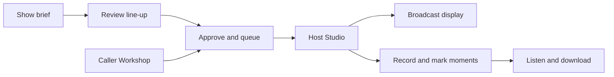

<div align="center">

<h1>AI Phone-In / Studio</h1>

<p><strong>Build and run live, human-hosted phone-in shows with fictional AI callers.</strong></p>

<p>
Create callers, arrange a live running order, hold private voice soundchecks and send a clean,<br />
privacy-filtered programme display to OBS, Twitch, TikTok Live Studio, Kick or another broadcast workflow.
</p>

<p>Start with a show idea. Shape a small line-up. Record the conversation and mark the moments worth keeping.</p>

<p>
  
  
  
  
  
  
  
  
  
  <a href="./LICENSE"></a>
</p>

<h2>Watch the demo</h2>

<a href="https://www.youtube.com/watch?v=eZAmzG3dG9I">
  
</a>

<p><strong><a href="https://www.youtube.com/watch?v=eZAmzG3dG9I">Watch the AI Phone-In / Studio demo on YouTube</a></strong></p>

</div>

> [!IMPORTANT]
> This is a hobbyist-first, local production toolkit. One trusted admin can build callers, run shows and open the same show from a second producer browser. It deliberately avoids enterprise account and team-management infrastructure so the live workflow stays approachable.

**[Roadmap and wider vision](./ROADMAP.md)** · **[MIT licence](./LICENSE)**

## The production flow



| Caller Workshop | Show workspace | Host Studio | Broadcast output |
| --- | --- | --- | --- |
| Start with one sentence, choose from six genuinely different routes, or quick-add a caller manually. Fine-tuning stays optional. | Own the running order, format, voice route, sound cues and output link. | Talk to callers, manage the queue, trigger media and monitor live audio. | Present only the public caller card, selected visual and caller audio EQ. |

The format is intentionally flexible. It can support advice, audience stories, sport, discussion, competitions, specialist topics, entertainment or a format of your own.

## What works today

- Multiple independent show workspaces.
- **Make tonight’s show:** one brief becomes four or six varied caller cards with a suggested running order. Keep, tweak, swap and reorder privately, then explicitly approve into a new off-air show.
- A deliberately shallow AI caller builder: one seed, optional call-type/tone preferences, six varied directions and one ready-to-use card.
- Quick manual caller creation with only the on-air essentials required; identity, voice, behavioural notes and graphics are collapsible extras.
- Searchable caller management with ready/draft/history status, topic filters, portraits, direct private soundchecks and one-click addition to a selected show.
- A six-caller demo pack spanning advice, personal stories and eccentric theories: Aisha, Ellie, Owen, Ruth, Baz and Priya.
- Selectable generated avatars, OpenAI image generation, Pexels and Pixabay visuals.
- Private caller soundchecks that cannot alter the live queue or programme output.
- OpenAI Realtime 1.5 browser voice as the default, with host/caller meters and transcripts.
- Optional **GPT-Live-1 full-duplex caller audio**, with 22 voice choices, compatible casting and private voice auditions. It is a separate adapter, not a renamed Realtime model.
- Optional Gemini Live routing with server-minted one-use browser credentials, native audio and adjustable VAD.
- Optional ElevenLabs Conversational AI and Fish Audio turn-based comparison routes with per-caller voice IDs.
- Explicit voice-presentation casting for generated and manually edited callers, with compatible OpenAI and Gemini voice selection.
- Three temporary Host Studio direction controls for caller energy, pace and answer length.
- Local audio recording of the Studio tab plus an optional microphone, with pause/resume, moment markers, playback and downloads. No recording upload or new cloud service.
- Drag-and-drop running orders, caller reactivation and additions during a live show.
- Automatic incoming, connected and host hang-up tones.
- Optional cheer, horn, rimshot and custom soundboard cues.
- Real CC0 applause, air horn, drum sting and telephone samples, with their own effects-volume control.
- Ten bundled, vocal-free background music tracks with one-click play, repeat, music volume and immediate stop. Music credits are copyable in Studio.
- Adaptive web, TikTok 9:16, Twitch/OBS 16:9 and transparent overlay output modes.
- A caller-output EQ shared with the broadcast display.
- Photographer/contributor attribution retained from stock search to the live output.
- Privacy-filtered broadcast data that excludes private caller mechanics and API keys.
- Two deliberately hidden automation modules: an AI Host with supervised and guarded auto-run modes, plus a staged 10–20-caller Factory. Both are off in a fresh installation and require a separate opt-in for each show.

## Quick start

### Requirements

- Node.js 20 or newer; Node 22 is recommended.
- npm.
- Chrome or Edge for microphone and WebRTC testing.
- An OpenAI API key for caller generation, AI images and OpenAI voice routes; GPT-Live requires model access on that API project.

### First run on Windows

```powershell
git clone https://github.com/paolodit/phone-in-studio.git
cd phone-in-studio
npm install
Copy-Item .env.example .env.local
npm run db:generate
npm run db:local:init
npm run dev
```

Edit `.env.local` before starting and replace at least:

```dotenv
ADMIN_PASSWORD=choose-a-local-admin-password
AUTH_SECRET=choose-a-long-random-secret
OPENAI_API_KEY=your-server-side-openai-key
```

Open [http://localhost:3000](http://localhost:3000) and sign in with `ADMIN_PASSWORD`.

> [!CAUTION]
> `npm run db:local:init` applies migrations without seeding or resetting user data. A fresh installation opens channel creation after login. The old demonstration callers remain available as an optional `npm run db:demo` import; `npm run db:seed` is a separate, destructive development-fixture reset, not a normal installation/start step.

For later sessions, normally run only:

```powershell
npm run dev
```

This starts the detached local PostgreSQL runtime and Next.js together. Leave `DATABASE_URL` unset in `.env.local` for the local workflow; the development script supplies the connection.

After pulling an update that adds database migrations, stop the app and run:

```powershell
npm run db:generate
npm run db:local:migrate
npm run dev
```

`db:local:migrate` applies schema updates without resetting or reseeding existing shows and callers.

To add or refresh the varied six-caller demo pack without resetting your own shows or callers:

```powershell
npm run db:demo
```

## Configuration

All provider credentials remain server-side. Never commit `.env.local`.

| Variable | Required | Purpose |
| --- | --- | --- |
| `ADMIN_PASSWORD` | Yes | Password for the local admin login. |
| `AUTH_SECRET` | Yes | Signs the HTTP-only admin session cookie. Use a long, unique value. |
| `OPENAI_API_KEY` | Recommended | Caller Workshop, OpenAI Realtime, GPT-Live and AI image generation. |
| `OPENAI_REALTIME_MODEL` | No | Overrides the default `gpt-realtime-1.5` voice model. |
| `OPENAI_LIVE_MODEL` | No | Overrides `gpt-live-1` for the separate GPT-Live adapter. Do not put this model in `OPENAI_REALTIME_MODEL`. |
| `OPENAI_CALLER_GENERATION_MODEL` | No | Overrides the Caller Workshop model. |
| `OPENAI_HOST_MODEL` | No | Overrides the model used to write AI Host turns. |
| `OPENAI_HOST_TTS_MODEL` | No | Overrides the speech model used for the AI Host; defaults to `tts-1`. |
| `OPENAI_IMAGE_MODEL` | No | Overrides the image-generation model. |
| `GEMINI_API_KEY` | No | Enables the Gemini Live comparison route. |
| `GEMINI_LIVE_MODEL` | No | Overrides `gemini-3.1-flash-live-preview`. |
| `GEMINI_LIVE_VOICE` | No | Forces one Gemini prebuilt voice instead of mapping caller voices. |
| `ELEVENLABS_API_KEY` | No | Enables the ElevenLabs Conversational AI route. |
| `ELEVENLABS_AGENT_ID` | No | Selects the ElevenLabs Agent used for conversations. |
| `FISH_API_KEY` | No | Enables the turn-based Fish Audio TTS/ASR comparison route. |
| `FISH_AUDIO_MODEL` | No | Fish speech model; defaults to `s2.1-pro-free`. |
| `FISH_AUDIO_VOICE_ID` | No | Optional global Fish voice model ID; a caller-level ID takes priority. |
| `FISH_AUDIO_LATENCY` | No | `low`, `balanced` (default) or `normal`. |
| `FISH_DIALOGUE_MODEL` | No | OpenAI model used to write caller turns before Fish renders them. |
| `PEXELS_API_KEY` | No | Enables Pexels topic-image search. |
| `PIXABAY_API_KEY` | No | Enables Pixabay search or provider fallback. |
| `DATABASE_URL` | Production only | PostgreSQL connection for a deployed environment. |

Restart `npm run dev` after changing environment variables.

## Using the studio

### First channel and starter packs

On a fresh installation, login opens **Create your first channel**. **Shows → New channel** and the sidebar’s plus button open the same flow for subsequent channels. A channel remains the existing Show workspace internally—there is no separate scheduling or broadcast engine.

1. **Give Me the Keys** keeps the existing blank-show setup and the “Make tonight’s show” planner.
2. **I’ll Take the Mic** is selected by default. Its menu contains **Am I the A\*\*hole?**, **Who Booked These Guests?** and **Bad Joke Hotline**, each designed for six independent curated guests.
3. **Auto-run the Show** has one preset for an AI presenter and five independent guests. Creation opts into AI Host but does not arm auto-run or start voice billing.

**Editorial status:** the final human casts, and the auto-run theme/presenter/cast, are awaiting confirmation. The cards are visible but cannot be created until their definitions are complete. No unrelated demo characters are silently substituted. The custom route works now. See [starter-pack authoring](docs/STARTER-PACKS.md) to finish or extend the catalogue.

Published packs are copied into ordinary, editable shows, callers, assets and (for auto-run) presenter profiles. Future template changes do not overwrite those copies. Music defaults on at a quiet level and starts with Start/Answer or an explicit auto-run start—not on page load. Studio’s Music tab retains track choice, volume, repeat and Stop, with an on/off preference saved per channel in this browser. Image autoplay defaults on for every caller and stays adjustable in Visuals. Pack creation prepares credited images from the existing Pexels/Pixabay integration, or uses explicitly curated existing images; missing stock credentials/results keep the portrait and produce a visible warning.

### Deleting a channel

Use **Delete channel** on its card or in Show options. The confirmation identifies the channel, requires its exact name and explains the permanent removal of its queue, events/transcripts, custom cues, per-show settings and broadcast link. A live show must be ended first.

Reusable caller cards/assets and presenter profiles stay. Factory batches are detached, saved plans return to draft, and other channels are unaffected. Browser recordings are retained and remain accessible at the channel’s original recordings URL (bookmark it or download first). Open Studio tabs move back to Channels; an open deleted broadcast is cleared. Deleting the last channel returns to creation.

### The quickest route: make tonight’s show

Open **Shows → Make tonight’s show**. Give it one creative brief—something like “a late-night show about starting over, with warmth, awkwardness and one strange caller”—then choose the length and four or six callers.

The planner proposes a title, editorial flow and complete caller cards. Each card explains why this person is calling now, what they want, their voice and a possible visual. Keep or remove cards, **Tweak** the essentials, **Swap** one for a different idea, and move callers earlier or later. Timings are editorial estimates, not automatic call cut-offs.

Plans are saved privately in the database and can be reopened under **Pick up a saved plan**. They do not populate your caller library, change an existing show or require the optional Caller Factory. Generation and swaps use your configured OpenAI generation model and may take a minute or two; review the output before approval.

**Approve selected & create show** creates approved callers and queues only the kept cards in a new **Ready**, off-air show. Nothing starts broadcasting. You can then use the existing caller editor, private soundchecks and media tools. Visual ideas are suggestions only: this flow does not fetch stock images or generate portraits automatically.

Prefer to build from individual callers? The manual workflow below remains available.

### 1. Build a caller

Open **Callers** and choose one of two routes:

- **Develop with AI** - enter a situation, opinion, story or dilemma; compare six directions; build one into a detailed caller card; then save it as an editable draft.
- **Create manually** - enter the public caller identity and private performance card directly.

The AI workshop never publishes automatically. Generated callers stay private until a producer reviews and approves them.

Caller graphics can come from the stored avatar library, a custom image URL, OpenAI image generation or a stock provider. Prepared topic images are separate from the caller portrait: tap them manually or enable **Autoplay images** in Studio to cycle them for every caller.

### 2. Test the caller privately

Open a caller and choose **Test voice privately**.

The soundcheck supports OpenAI Realtime, GPT-Live-1, Gemini Live, ElevenLabs or Fish Audio, displays microphone and caller-output meters, and keeps a temporary transcript. **Open test output** provides a separate presentation view for checking the portrait and caller EQ.

This test route does not update a show, running order, production event log or live broadcast display. Use headphones, hear the opening line, speak naturally and pause for the reply.

### 3. Create a show

Open **Shows**, choose **New channel → Give Me the Keys**, then configure:

- programme title and format;
- show-level caller guidance;
- OpenAI Realtime, GPT-Live-1, Gemini Live, ElevenLabs or Fish Audio voice routing;
- approved callers and their running order;
- custom sound cues and shortcuts;
- the private broadcast-output link.

Each show owns its own Studio, running order, options and output.

### 4. Go live

1. Open the show in **Studio** and start the show.
2. Bring in the first caller; the programme display changes to **Coming up next**.
3. Answer when the host is ready and connect the selected AI voice route.
4. The caller opens naturally, then responds after each host turn.
5. Interrupt, mute, hold, resume, show prepared media or trigger optional sounds as needed.
6. End the call; the hang-up tone plays and the next caller is prepared automatically.
7. Reactivate completed callers or requeue the full running order when needed.

There is no redundant second step to fetch the next caller after ending a call. The next caller is prepared automatically, while the host controls the exact moment they go on air.

The **live control strip stays visible while you scroll**. Answer/resume follows the state of the line; **Take the floor** (Space), mute, hold and end-call controls appear when relevant. Microphone/caller meters and caller volume stay within reach during a connected call. **Stop all** (Escape) stops local caller audio, pending AI-host speech and sound cues. Holding a caller mutes both their output and their access to the host microphone.

The show workspace opens on the running order, with a searchable **Add a caller** lane alongside it. Finished callers are collapsed, not deleted. Drag queued callers to reorder them, or focus a row and use **Alt + Up/Down**. Show options, optional checks and custom sound setup stay out of the main preparation path.

**On-air tools** has three compact views:

- **Visuals:** image-first thumbnails, shortcut numbers and an On air badge. Long stock descriptions stay off the tiles; creator attribution on the broadcast output is unchanged.
- **Sounds:** actual applause, air horn, drum sting and receiver recordings replace the oscillator placeholders. C/H/R/G shortcuts remain available. Effects volume also scales custom cues; Stop effects silences the soundboard without stopping music or the caller. Automatic phone sounds can be previewed without changing the call.
- **Music:** ten instrumental tracks for conversation, intros and breaks. Click a track to play it, adjust Music volume, repeat it, or stop it. Only one music track plays at a time. A persistent playing strip remains visible when you switch back to Visuals/Sounds. Volume and repeat preferences are saved per show in this browser; playback never auto-starts after a reload.

Music comes from Kevin MacLeod's catalogue under **CC BY 4.0**, which allows royalty-free use with attribution. Use **Copy music credits** and include the credit in your stream/video description. CC0 sound effects need no attribution, but their creators are documented too. See [audio sources, licences and credits](./public/audio/CREDITS.txt). These third-party audio files are licensed separately from the app's MIT code; no guarantee is made against automated platform claims.

The media is bundled locally, not streamed from a stock service. Both music and effects play in the Studio tab, so OBS tab/browser-audio capture and the built-in tab recorder can include them. Use headphones to avoid feeding a music bed back into the caller microphone. **Stop all**, ending the show or leaving the Studio stops background music too.

### 5. Record and revisit the good moments

In Studio, open **Record your show** and choose **Start recording**. In Chrome or Edge, select **this Studio browser tab**, enable **Share tab audio**, and allow the microphone if you want the human host in the recording. Use headphones and check the tab-audio and microphone meters before you begin. If your in-app browser does not offer tab-audio sharing, open the local Studio in Chrome or Edge.

- The tab supplies AI voices and sound cues across all providers. The optional microphone supplies the human host. For an AI-host-only show, you can turn the microphone off.
- **Mark moment** adds a timestamp, optionally named, without interrupting the call. **Pause recording** excludes private conversation from the capture and its timeline. Holding a caller does **not** pause recording.
- **Stop & save**, ending the show, an emergency stop or a disconnected capture source finishes the recording. Captures stop at two hours; start another to continue.
- Open **Recordings** in Studio or **Recordings & moments** from the show workspace. Listen, jump to a marker, rename moments, download the audio, and export transcript text or JSON notes.
- If a tab closed unexpectedly, use **Recover unfinished capture**. It refuses recovery while a Studio tab still owns that recording. Saved chunks may be incomplete; check playback.

> [!IMPORTANT]
> This first version records **audio, not video**, to this browser’s IndexedDB storage. Nothing is uploaded or synced between browsers. Clearing site data or changing site address/browser can make recordings unavailable. Download a copy after each show. Disk/storage failures and abrupt browser closure can lose the final seconds.

Downloads use WebM/Opus or M4A, depending on browser support. Markers are editing notes, not automatically rendered clips. Transcripts contain only live provider events received while recording; timestamps mark receipt, not exact word alignment, and no new transcription is performed. Other sounds from the selected tab are captured too—avoid unrelated audio while recording.

## Simple two-producer operation

Keep the **Host Studio** open for the presenter and the relevant **show workspace** open for a producer in another browser or computer.

The producer can create and approve new callers and add them to the running order while the host continues the current call. The Studio refreshes its queue without interrupting live caller audio.

Both browsers intentionally use the same trusted local admin. Avoid editing the same caller or running order at exactly the same moment; proper organisation accounts, invitations, presence and role management are outside this hobbyist-first scope.

## Optional automation modules

The normal first-run experience remains a human host building or choosing callers manually. Open **Settings → Optional modules** only when you want automation. A global switch makes a module available; each show then opts into it separately under **Show options**. Disabling a global switch removes the module from normal navigation without deleting its profiles, batches or callers.

### AI Host

1. Enable **AI Host** under Optional modules.
2. Create a presenter profile with a public identity, voice, style and a few behavioural sliders.
3. Use the private soundcheck to hear one response without touching a live show.
4. Open the show’s **Options → Who hosts this show?**. Choose **AI presenter · one turn at a time** or **AI presenter · automatic conversations**, select the presenter, then **Save & open Studio**. Selecting **You · human host** turns AI hosting off for this show; there is no second enable checkbox to conflict with this choice.
5. For one-turn hosting, answer and connect a caller first, then press **AI host: one turn**. The presenter control explains this prerequisite when it is not yet available.
6. For automatic conversations, choose a per-caller presenter-turn limit, delay between calls and visual policy, then deliberately press **Start auto-run** in Studio. Keep that Studio open; it runs the audio and queue. Provider connections may still require browser microphone permission; use headphones.

Auto-run starts and answers queued callers, responds after completed caller turns, closes at the configured turn limit, and advances the running order. It never arms on page load. **Take over**, **Pause auto-run** and **Emergency Stop** remain authoritative, and a generation, speech or transition error pauses automation for the human host.

The presenter still uses a text-generation → speech pipeline, not a second GPT-Live agent. Its exact spoken line is handed to the caller after playback finishes. Short acknowledgements from a microphone cannot drive an automatic conversation: auto-run mutes microphone input, and **Take over** restores it. Private soundcheck Stop cancels both pending generation and playing audio. No host test writes to a live show.

Automated topic preparation has three policies: **Off** does not prepare or select an image automatically; **Prepare** gives the host three credited stock images to trigger manually; **Full auto** prepares those images and shows the primary one after the caller's opening contribution. Images are fetched while developing or accepting the candidate rather than during the live call. A missing provider key, empty search or display error falls back to the portrait and never stops the audio conversation. The independent slideshow below takes precedence when enabled.

### Image autoplay — for human or AI hosts

In **Studio → On-air tools → Visuals**, switch on **Autoplay images**. This is saved for the whole show, not one caller. Choose 5, 10, 15, 20 or 30 seconds per image (10 by default). While each caller is on air, their queued supporting images loop with the original creator credits. One image stays visible; no images leaves the portrait. New callers start their own set, and held/ended calls stop cycling.

Tap a thumbnail to jump to it and restart the interval. Uncheck autoplay to keep the current image still; **Clear visual** stops autoplay and removes it. Output windows follow a shared persisted clock, so OBS and browser previews keep cycling without a foreground Studio tab or repeated database writes. Each output receives only the current caller’s public image fields; private character instructions and provider keys stay on the server.

### Caller Factory

The Factory develops **10–20 candidates per batch** from a broad editorial brief. It works in small resumable chunks, checks new headlines against the batch and existing caller library, and stores results in a separate candidate inbox. When its show enables prepared or automatic visuals, each new candidate also receives up to three topic images with creator and provider attribution. You can pause or cancel a batch, edit a candidate, reject it, restore it, or accept one or all candidates.

Acceptance is the boundary: only an accepted candidate becomes a normal editable caller draft. Nothing is automatically approved, queued or sent to a broadcast. An optional show assignment gives the batch editorial context but still does not alter that show's running order.

## Voice routes

### OpenAI Realtime

The default is `gpt-realtime-1.5`. The browser captures the host microphone and creates a WebRTC offer. The server negotiates the Realtime call with `OPENAI_API_KEY`; the permanent key is never sent to the browser.

**Guarded interruptions** is the default in Studio and the private soundcheck. Semantic VAD stays on at high eagerness, while the browser controls response creation and cancellation:

- A normal host turn gets a reply as soon as its audio is committed at the semantic endpoint; it does not wait for transcription.
- While the caller is speaking, short transcribed acknowledgements such as “uh-huh”, “right” and “go on” do not trigger cancellation or a second reply.
- A meaningful phrase or explicit “wait” can take the floor. Partial transcripts need more evidence than finished ones; a new response waits for the old generation to acknowledge cancellation.
- **Manual** mode disables the transcript guard's automatic cut-in. **Take the floor / Interrupt** remains available in either mode.

This is an English transcript heuristic, not a full-duplex model or perfect speech-intent detector. It depends on provider transcription and can miss a short interjection or misread a noisy room. Compare both modes with headphones in a **private soundcheck** before going live. The underlying controls follow OpenAI's [VAD guidance](https://developers.openai.com/api/docs/guides/realtime-vad).

The last-reply timing in the UI measures the semantic speech-end event to the caller-stream-start event. It **excludes** time spent deciding that the host finished and browser/audio-device playout; it is not an end-to-end latency benchmark. Replies have a 1,024-token runaway ceiling, with normal length controlled by the caller prompt rather than the former 180-token limit that could cut speech short.

Each caller can have a supported voice, perceived voice-presentation preference, pace, speech style, response length and interruption behaviour. Feminine, masculine and neutral preferences are casting metadata rather than a claim about the character's identity. OpenAI and Gemini enforce a compatible voice; **Any** preserves a producer's exact choice. ElevenLabs and Fish callers can each store a provider-specific voice/model ID; otherwise that route's global or agent default remains in control.

While a caller is connected, the Host Studio exposes three centred sliders: **Energy**, **Pace** and **Answer length**. They nudge the next reply relative to the saved caller card and reset for every new caller. They do not permanently edit the character. Gemini queues a change until its current answer finishes so moving a control cannot interrupt the caller.

Microphone access requires `http://localhost:3000` on the same computer or an HTTPS deployment. A plain HTTP LAN address is not a secure browser context and cannot use `getUserMedia`.

### OpenAI GPT-Live-1 · full duplex

Use the existing `OPENAI_API_KEY`, then choose **OpenAI GPT-Live-1 (full duplex)** in **Studio → Audio setup → Caller route**, a show's **Options**, or a caller's **private soundcheck**. Existing shows stay on their current route; Realtime 1.5 remains the default. No database migration or extra Agent ID is needed.

**Cast each caller, not just the show.** GPT-Live offers 22 built-in voices. The saved OpenAI voice and voice-presentation preference remain the default match. To give a caller a different Live voice, open **Edit caller → Voice and delivery → GPT-Live voice**. Regional choices include Vesper (British masculine), Willow (Irish feminine), Stone (Irish masculine), Quartz (Australian feminine) and Ripple (Australian masculine). Regional influence is a guide, not a guaranteed accent. **Any** permits an exact producer choice without presentation matching. In a private soundcheck, the audition selector lets you compare voices without saving them or changing the live show. End a test before changing its voice.

This adapter uses the dedicated [Live API](https://developers.openai.com/api/docs/guides/live), a short caller-specific prompt and continuous WebRTC audio. It waits for `session.started` and acknowledges opening instructions before prompting the caller to begin. It does **not** reuse Realtime's semantic VAD, transcript-cancellation heuristic, `response.create` loop or Gemini's microphone gate. The caller can listen while speaking; instructions distinguish brief “uh-huh” acknowledgements from a host deliberately taking the floor. Real-room behaviour still needs a headset test—this is not a promise of perfect interruption detection.

**Space / Interrupt** silences local playback immediately and asks the model to yield. Live has no Realtime-style output-cancel command; playback is re-armed after measured remote silence. Caller volume, mute, input-device switching, producer direction, transcript display, broadcast EQ and Studio-tab recording use the existing workflow. The optional AI Host still uses its existing presenter text/TTS route; this change adds GPT-Live for the callers, not a second autonomous Live agent.

> [!IMPORTANT]
> GPT-Live is billed for connected time, including silence and hold. Use **End call / End test** when finished. The adapter sends `session.close`, waits for confirmation, and uses a server-side hangup fallback on connection failure. API recording is disabled with `store: false`; your optional local Studio recording is separate. No external tools or background research are enabled for the Live caller.

For setup details, protocol boundaries and a repeatable test checklist, see **[GPT-Live integration notes](./docs/GPT-LIVE.md)** and OpenAI's [Live prompting guidance](https://developers.openai.com/api/docs/guides/live-prompting).

### Gemini Live

Set `GEMINI_API_KEY`, restart the app, then select **Gemini Live** in Show options or the private soundcheck. The adapter currently targets `gemini-3.1-flash-live-preview` and uses Google's official `@google/genai` SDK.

The permanent key remains server-side. The server creates a one-use, one-minute connection credential whose session configuration is locked to the selected caller. Browser audio is sent as PCM; Gemini audio is played through the same caller-output meter and broadcast EQ used by the other providers.

The current comparison settings use:

- low speech-start sensitivity with a 650 ms speech commitment window to reject incidental room noise;
- low speech-end sensitivity with 600 ms silence tolerance so a natural host pause stays within one turn;
- smaller input packets (1,024 samples, approximately 21 ms at 48 kHz, previously 4,096 / 85 ms);
- a protective microphone gate for the caller reply plus a 100 ms acoustic tail, down from the previous 350 ms timer and additional 120 ms delay;
- no automatic microphone barge-in while the caller is answering; use the Studio's **Interrupt** control or **Space** shortcut for a deliberate cut-in;
- minimal thinking, audio input/output transcripts and a 1,024-token runaway guard; normal answer length is controlled by the caller prompt rather than a seven-second audio ceiling.

This is an optional preview route, not a promise that it will outperform OpenAI in every room. Test with the actual microphone, headphones and ambient noise you intend to use. Gemini Live sessions and preview model availability are provider constraints; see Google's [Live API guide](https://ai.google.dev/gemini-api/docs/live-api) and [ephemeral-token guidance](https://ai.google.dev/gemini-api/docs/live-api/ephemeral-tokens).

In-session text now uses `sendRealtimeInput`, as required by the [Gemini 3.1 capabilities guide](https://ai.google.dev/gemini-api/docs/live-api/capabilities). A manual interruption silences local playback and rejects late audio from that turn. It does not promise immediate cancellation of remote generation while `NO_INTERRUPTION` is enabled. Gemini remains a protected, turn-taking comparison route, not the new OpenAI transcript-guarded mode.

### ElevenLabs Conversational AI

Set `ELEVENLABS_API_KEY` and `ELEVENLABS_AGENT_ID`, restart the app, then select **ElevenLabs Agent** in Show options or the private soundcheck.

The server requests a short-lived conversation token for each connection. Caller instructions are passed as a session override, and an optional caller voice ID can replace the Agent default.

### Fish Audio S2.1

Set `FISH_API_KEY`, restart the app, then select **Fish Audio S2.1 (turn-based)** in Show options or the private soundcheck. The default is Fish's `s2.1-pro-free` developer-tier model; set `FISH_AUDIO_MODEL=s2.1-pro` to compare the paid model. A Fish voice page's model ID can be stored on an individual caller, or supplied globally with `FISH_AUDIO_VOICE_ID`.

Fish Audio currently supplies speech synthesis and beta speech recognition, not the conversational reasoning and duplex session used by OpenAI Realtime or Gemini Live. The adapter therefore uses a clear four-stage turn:

1. conservative browser speech detection waits for a sustained host contribution and a 950 ms finishing pause;
2. the captured host turn is transcribed by Fish ASR;
3. the existing character prompt and `FISH_DIALOGUE_MODEL` prepare one short caller reply;
4. Fish TTS renders the reply through the normal caller-output meter and broadcast EQ.

This route deliberately ignores microphone noise while the caller is playing. **Interrupt** stops playback, but Fish cannot provide true full-duplex barge-in in this integration. It is best used to compare voice naturalness, pace and casting rather than interaction latency. `FISH_AUDIO_LATENCY=balanced` is the default compromise; `low` starts faster at a possible quality cost, while `normal` favours quality.

The Fish key remains server-side. The app accepts Fish's official `FISH_API_KEY` variable and calls the documented [`POST /v1/tts`](https://docs.fish.audio/api-reference/endpoint/openapi-v1/text-to-speech) and [`POST /v1/asr`](https://docs.fish.audio/api-reference/endpoint/openapi-v1/speech-to-text) endpoints. Check Fish's live [pricing and concurrency limits](https://docs.fish.audio/developer-guide/models-pricing/pricing-and-rate-limits) before a long show: TTS is measured by input bytes, ASR by audio duration, and the starter tier currently permits five concurrent requests.

## Broadcast output

Open **Broadcast output** from a show workspace. Its URL contains an unguessable show token; treat the URL as private.

Use **Test layouts** first to open a private output workbench. Preview all eight call/show states, 16:9, 9:16, square and a short 640 × 240 pane; toggle portraits, topic images, transparency and a clearly labelled simulated EQ. None of these controls changes the live show or plays sound. **Copy live output URL** copies the real output address with the selected layout and background mode, not a link to the simulation.

The renderer uses its pane's dimensions, not the surrounding app window. Small/short panes omit the optional summary; long headlines are line-limited. Topic visuals remain edge-to-edge with a compact creator credit. Portrait TikTok output leaves extra bottom space, but placement still needs checking against your platform's current interface overlays.

Recommended OBS setup:

1. Add the output URL as a Browser Source.
2. Treat the browser source as one content pane in your scene; the app does not assume or reserve a host-webcam object.
3. Use `layout=twitch` at 1920 x 1080 for a wide Twitch/OBS pane.
4. Use `layout=tiktok` at 1080 x 1920 for a portrait TikTok Live Studio pane.
5. Use `layout=web` when the pane may resize; it switches composition from its actual aspect ratio.
6. Use `mode=overlay` for a transparent treatment; layout defaults to `web`.
7. Capture the host microphone separately, then capture Studio browser audio for AI callers and sound cues.

Example URLs (retain the show's real token):

```text
/broadcast/SHOW_ID?token=TOKEN&mode=full&layout=web
/broadcast/SHOW_ID?token=TOKEN&mode=full&layout=tiktok
/broadcast/SHOW_ID?token=TOKEN&mode=full&layout=twitch
/broadcast/SHOW_ID?token=TOKEN&mode=overlay
```

The broadcast page does not emit the host microphone. Its EQ is driven by caller output reported by the Studio, so it should move only while the AI caller is producing audio.

Same-browser output previews receive meter frames directly through a show-scoped `BroadcastChannel`. Separate OBS browsers and remote screens use the existing token-protected event stream. Meter updates cannot pile up overlapping HTTP requests, invalid frames are ignored, and stale signal falls back to silence. The transparent mode also clears the document background, not just the inner panel.

## Privacy and safety boundaries

- `.env.local` is server-only and must not be committed.
- The admin session uses an HTTP-only signed cookie.
- Permanent OpenAI, Gemini, ElevenLabs and Fish Audio keys are never returned to the browser.
- The broadcast API exposes only public identity, public issue, caller graphic and the selected visual (plus a public image playlist while autoplay is enabled).
- Hidden story details, private prompts and producer notes remain inside authenticated tools.
- Generated and stock images still require editorial, licensing and broadcast-safety review.

For an internet-facing deployment, still add TLS, managed secrets, database backups and network access controls. The shared-admin workflow is intentional; this project is not trying to become a team SaaS account system.

## Commands

| Command | Purpose |
| --- | --- |
| `npm run dev` | Start the local database if required and run Next.js development mode. |
| `npm run db:generate` | Regenerate the Prisma client. |
| `npm run db:local:init` | Apply migrations without resetting or seeding channels. |
| `npm run db:local:migrate` | Apply local schema updates without resetting shows or callers. |
| `npm run verify:channels` | Verify pack creation and deletion in a separate, automatically removed local test schema; no provider calls. |
| `npm run db:local:stop` | Stop the detached local database runtime. |
| `npm run lint` | Run the TypeScript no-emit check. |
| `npm test` | Run the Vitest suite. |
| `npm run verify:local` | Verify an isolated show-state, persistence and privacy flow. |
| `npm run verify:planner` | Verify private planning and idempotent off-air approval using temporary, self-cleaning database fixtures. |
| `npm run verify:realtime` | Verify an OpenAI temporary session credential without sending audio. |
| `npm run verify:live -- --allow-billable` | Opt-in API smoke check for two GPT-Live voices using synthetic silence. Creates short billable sessions; captures no microphone and saves no audio. |
| `npm run build` | Create a production build; stop the development server first. |

## Troubleshooting

<details>
<summary><strong>The app cannot reach 127.0.0.1:51214</strong></summary>

Stop any stale local database runtime and start again:

```powershell
npm run db:local:stop
npm run dev
```

For a new checkout, run `npm run db:local:init` once first.
</details>

<details>
<summary><strong>The microphone is unavailable</strong></summary>

- Use Chrome or Edge.
- Open exactly `http://localhost:3000`, not a plain HTTP LAN address.
- Allow microphone access in the browser's site controls, then use the in-app retry.
- Close applications that may have exclusive control of the device.
</details>

<details>
<summary><strong>The caller connects but cannot be heard</strong></summary>

- Check the caller volume and operating-system output device.
- Confirm the **Caller output** meter is moving.
- Use headphones to prevent feedback.
- End and reconnect; each attempt creates a fresh short-lived credential.
- Use the mock speaker line to separate output-device problems from provider problems.
</details>

<details>
<summary><strong>GPT-Live cannot connect or its voice does not change</strong></summary>

- Confirm the API project has access to `gpt-live-1` and the server has `OPENAI_API_KEY`. A model appearing in the selector does not guarantee account access.
- Select the dedicated **GPT-Live-1** route, not Realtime with a renamed model. Leave `OPENAI_LIVE_MODEL` unset to use its default.
- End the existing session before changing voices; Live fixes its model and voice at startup.
- Stored voice choices respect the caller's voice-presentation preference. Choose a compatible voice or set presentation to **Any**. The private audition selector deliberately previews your exact selection.
- If shutdown cannot be confirmed, check the API project's active sessions before leaving the app unattended.
- Keep the microphone stream running, use headphones, and verify browser audio playback. Silence is valid input; no push-to-talk or manual reply trigger is needed.
</details>

<details>
<summary><strong>Gemini Live cannot start a caller</strong></summary>

Confirm `GEMINI_API_KEY` is present in `.env.local`, restart the app, and use a Gemini project with Live API access. Every attempt creates a fresh credential, so reconnect rather than reusing a failed session. If a preview model has changed, override `GEMINI_LIVE_MODEL` with a model supported by your project.
</details>

<details>
<summary><strong>ElevenLabs cannot start a caller</strong></summary>

Confirm that the API key and Agent ID belong to the same account and that the Agent supports WebRTC conversations. Restart the app after changing `.env.local`.
</details>

<details>
<summary><strong>Fish Audio cannot start or hear the host</strong></summary>

Confirm `FISH_API_KEY` and `OPENAI_API_KEY` are present in `.env.local`, then restart the server. Test the caller in the private soundcheck first. A 401 usually means the Fish key is invalid; 402 indicates account credit or plan access; 422 commonly points to an invalid caller voice model ID or unsupported request. If transcription repeatedly hears nothing, use Chrome or Edge on `http://localhost:3000`, allow microphone access and finish a full sentence before pausing.

</details>

## Project map

```text
app/                  Next.js pages, APIs and broadcast routes
components/           Studio, caller workshop, soundcheck and broadcast UI
lib/                  Show state, prompts, voice providers, auth and integrations
prisma/               Schema, migrations and development fixtures
scripts/              Local database and verification tools
tests/                State, queue, prompt, generation and voice tests
public/               Bundled caller and interface assets
```

## Sensible next steps

These are the immediate engineering priorities. The broader product directions—better phone-ins, interview practice, personal breakfast television and turning feeds into programmes—are described in the **[roadmap and vision](./ROADMAP.md)**.

- Test the complete brief → line-up → live show → local recording loop with a real headset and short show.
- Build clip export from marked moments, with caption editing and portrait/landscape presentation; the current recorder exports audio, not video.
- Add reusable show identities and more purposeful editorial pacing, without making preparation a long form.
- Real-room comparison and tuning across GPT-Live-1, OpenAI Realtime 1.5, Gemini Live, ElevenLabs and the turn-based Fish Audio route.
- Real-show testing and recovery tuning for guarded AI Host auto-run.
- Scheduling, cost caps and semantic duplicate detection for recurring Caller Factory batches.
- A 1:1 output preset plus user-adjustable safe areas and theme controls.
- Managed deployment, secrets, PostgreSQL backups and operational monitoring.
- More robust audio reconnection, device switching and provider failover.
- A reusable media library, attribution backfill for old assets and licence-review notes.
- Optional SIP or PSTN integration for real telephone lines.
- End-to-end browser automation for Studio and broadcast interactions.

Before every public stream, run the automated checks and then complete a real browser, headset and broadcast-route soundcheck:

```powershell
npm run lint
npm test
npm run verify:local
npm run verify:realtime
```

## Licence

AI Phone-In Studio is available under the **[MIT License](./LICENSE)**. Copyright © 2026 Two Guys One Cat.

---

<div align="center">
Made with ❤️ by <a href="https://www.twoguysonecat.com">Two Guys One Cat</a>.
</div>
