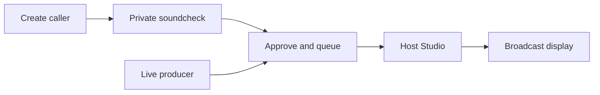

<div align="center">

<h1>AI Phone-In / Studio</h1>

<p><strong>Build and run live, human-hosted phone-in shows with fictional AI callers.</strong></p>

<p>
Create callers, arrange a live running order, hold private voice soundchecks and send a clean,<br />
privacy-filtered programme display to OBS, Twitch, TikTok Live Studio, Kick or another broadcast workflow.
</p>

<p>
  
  
  
  
  
  
</p>

</div>

> [!IMPORTANT]
> This repository is a usable local development build. The core caller, show, Studio, voice and broadcast workflows work. It is not yet a hardened public multi-user service; review [what remains](#what-remains) before using it for a public stream.

## The production flow



| Caller Workshop | Show workspace | Host Studio | Broadcast output |
| --- | --- | --- | --- |
| Develop or manually create reusable callers, voices, portraits and visuals. | Own the running order, format, voice route, sound cues and output link. | Talk to callers, manage the queue, trigger media and monitor live audio. | Present only the public caller card, selected visual and caller audio EQ. |

The format is intentionally flexible. It can support advice, audience stories, sport, discussion, competitions, specialist topics, entertainment or a format of your own.

## What works today

- Multiple independent show workspaces.
- AI-assisted caller development from one seed into six editable directions.
- Manual caller creation, approval, archive and topic-tag workflows.
- Selectable generated avatars, OpenAI image generation, Pexels and Pixabay visuals.
- Private caller soundchecks that cannot alter the live queue or programme output.
- OpenAI Realtime browser voice with host/caller meters and transcripts.
- Optional ElevenLabs Conversational AI routing and per-caller voice IDs.
- Drag-and-drop running orders, caller reactivation and additions during a live show.
- Automatic incoming, connected and host hang-up tones.
- Optional cheer, horn, rimshot and custom soundboard cues.
- Full-screen and overlay broadcast modes for browser-source capture.
- A caller-output EQ shared with the broadcast display.
- Privacy-filtered broadcast data that excludes private caller mechanics and API keys.

## Quick start

### Requirements

- Node.js 20 or newer; Node 22 is recommended.
- npm.
- Chrome or Edge for microphone and WebRTC testing.
- An OpenAI API key for caller generation, AI images and OpenAI Realtime voice.

### First run on Windows

```powershell
git clone https://github.com/paolodit/phone-in-studio.git
cd phone-in-studio
npm install
Copy-Item .env.example .env.local
npm run db:generate
npm run db:local:init
npm run dev
```

Edit `.env.local` before starting and replace at least:

```dotenv
ADMIN_PASSWORD=choose-a-local-admin-password
AUTH_SECRET=choose-a-long-random-secret
OPENAI_API_KEY=your-server-side-openai-key
```

Open [http://localhost:3000](http://localhost:3000) and sign in with `ADMIN_PASSWORD`.

> [!CAUTION]
> `npm run db:local:init` applies migrations and resets the development fixtures. Use it for first-time setup or an intentional reset, not as the normal start command when you want to retain local shows and callers.

For later sessions, normally run only:

```powershell
npm run dev
```

This starts the detached local PostgreSQL runtime and Next.js together. Leave `DATABASE_URL` unset in `.env.local` for the local workflow; the development script supplies the connection.

## Configuration

All provider credentials remain server-side. Never commit `.env.local`.

| Variable | Required | Purpose |
| --- | --- | --- |
| `ADMIN_PASSWORD` | Yes | Password for the local admin login. |
| `AUTH_SECRET` | Yes | Signs the HTTP-only admin session cookie. Use a long, unique value. |
| `OPENAI_API_KEY` | Recommended | Caller Workshop, OpenAI Realtime and AI image generation. |
| `OPENAI_REALTIME_MODEL` | No | Overrides the default Realtime model. |
| `OPENAI_CALLER_GENERATION_MODEL` | No | Overrides the Caller Workshop model. |
| `OPENAI_IMAGE_MODEL` | No | Overrides the image-generation model. |
| `ELEVENLABS_API_KEY` | No | Enables the ElevenLabs Conversational AI route. |
| `ELEVENLABS_AGENT_ID` | No | Selects the ElevenLabs Agent used for conversations. |
| `PEXELS_API_KEY` | No | Enables Pexels topic-image search. |
| `PIXABAY_API_KEY` | No | Enables Pixabay search or provider fallback. |
| `DATABASE_URL` | Production only | PostgreSQL connection for a deployed environment. |

Restart `npm run dev` after changing environment variables.

## Using the studio

### 1. Build a caller

Open **Callers** and choose one of two routes:

- **Develop with AI** - enter a situation, opinion, story or dilemma; compare six directions; build one into a detailed caller card; then save it as an editable draft.
- **Create manually** - enter the public caller identity and private performance card directly.

The AI workshop never publishes automatically. Generated callers stay private until a producer reviews and approves them.

Caller graphics can come from the stored avatar library, a custom image URL, OpenAI image generation or a stock provider. Prepared topic images are separate from the caller portrait and are always triggered manually by the producer or host.

### 2. Test the caller privately

Open a caller and choose **Test voice privately**.

The soundcheck supports OpenAI Realtime or ElevenLabs, displays microphone and caller-output meters, and keeps a temporary transcript. **Open test output** provides a separate presentation view for checking the portrait and caller EQ.

This test route does not update a show, running order, production event log or live broadcast display. Use headphones, hear the opening line, speak naturally and pause for the reply.

### 3. Create a show

Open **Shows**, choose **New show**, then configure:

- programme title and format;
- show-level caller guidance;
- OpenAI Realtime or ElevenLabs voice routing;
- approved callers and their running order;
- custom sound cues and shortcuts;
- the private broadcast-output link.

Each show owns its own Studio, running order, options and output.

### 4. Go live

1. Open the show in **Studio** and start the show.
2. Bring in the first caller; the programme display changes to **Coming up next**.
3. Answer when the host is ready and connect the selected AI voice route.
4. The caller opens naturally, then responds after each host turn.
5. Interrupt, mute, hold, resume, show prepared media or trigger optional sounds as needed.
6. End the call; the hang-up tone plays and the next caller is prepared automatically.
7. Reactivate completed callers or requeue the full running order when needed.

There is no redundant second step to fetch the next caller after ending a call. The next caller is prepared automatically, while the host controls the exact moment they go on air.

## Two-producer operation

Keep the **Host Studio** open for the presenter and the relevant **show workspace** open for a producer in another browser or computer.

The producer can create and approve new callers and add them to the end of the running order while the host continues the current call. The Studio refreshes its queue without interrupting live caller audio. This currently shares database state but does not yet provide producer presence, edit locks or conflict warnings.

## Voice routes

### OpenAI Realtime

The browser captures the host microphone and creates a WebRTC offer. The server negotiates the Realtime call with `OPENAI_API_KEY`; the permanent key is never sent to the browser.

Each caller can have a supported voice, pace, speech style, response length and interruption behaviour. Microphone access requires `http://localhost:3000` on the same computer or an HTTPS deployment. A plain HTTP LAN address is not a secure browser context and cannot use `getUserMedia`.

### ElevenLabs Conversational AI

Set `ELEVENLABS_API_KEY` and `ELEVENLABS_AGENT_ID`, restart the app, then select **ElevenLabs Agent** in Show options or the private soundcheck.

The server requests a short-lived conversation token for each connection. Caller instructions are passed as a session override, and an optional caller voice ID can replace the Agent default.

## Broadcast output

Open **Broadcast output** from a show workspace. Its URL contains an unguessable show token; treat the URL as private.

Recommended OBS setup:

1. Add the output URL as a Browser Source.
2. Start with a 1920 x 1080 source for the full layout.
3. Use `mode=full` for the complete display.
4. Use `mode=overlay` for a transparent lower-third treatment.
5. Capture the host microphone separately.
6. Capture Studio browser audio for AI callers and sound cues.

The broadcast page does not emit the host microphone. Its EQ is driven by caller output reported by the Studio, so it should move only while the AI caller is producing audio.

## Privacy and safety boundaries

- `.env.local` is server-only and must not be committed.
- The admin session uses an HTTP-only signed cookie.
- Permanent OpenAI and ElevenLabs keys are never returned to the browser.
- The broadcast API exposes only public identity, public issue, caller graphic and the selected visual.
- Hidden story details, private prompts and producer notes remain inside authenticated tools.
- Generated and stock images still require editorial, licensing and broadcast-safety review.

For a public deployment, replace the shared local admin login with user accounts, role enforcement, audit controls, TLS, managed secrets and backed-up PostgreSQL.

## Commands

| Command | Purpose |
| --- | --- |
| `npm run dev` | Start the local database if required and run Next.js development mode. |
| `npm run db:generate` | Regenerate the Prisma client. |
| `npm run db:local:init` | Apply migrations and reset local fixtures. |
| `npm run db:local:stop` | Stop the detached local database runtime. |
| `npm run lint` | Run the TypeScript no-emit check. |
| `npm test` | Run the Vitest suite. |
| `npm run verify:local` | Verify an isolated show-state, persistence and privacy flow. |
| `npm run verify:realtime` | Verify an OpenAI temporary session credential without sending audio. |
| `npm run build` | Create a production build; stop the development server first. |

## Troubleshooting

<details>
<summary><strong>The app cannot reach 127.0.0.1:51214</strong></summary>

Stop any stale local database runtime and start again:

```powershell
npm run db:local:stop
npm run dev
```

For a new checkout, run `npm run db:local:init` once first.
</details>

<details>
<summary><strong>The microphone is unavailable</strong></summary>

- Use Chrome or Edge.
- Open exactly `http://localhost:3000`, not a plain HTTP LAN address.
- Allow microphone access in the browser's site controls, then use the in-app retry.
- Close applications that may have exclusive control of the device.
</details>

<details>
<summary><strong>The caller connects but cannot be heard</strong></summary>

- Check the caller volume and operating-system output device.
- Confirm the **Caller output** meter is moving.
- Use headphones to prevent feedback.
- End and reconnect; each attempt creates a fresh short-lived credential.
- Use the mock speaker line to separate output-device problems from provider problems.
</details>

<details>
<summary><strong>ElevenLabs cannot start a caller</strong></summary>

Confirm that the API key and Agent ID belong to the same account and that the Agent supports WebRTC conversations. Restart the app after changing `.env.local`.
</details>

## Project map

```text
app/                  Next.js pages, APIs and broadcast routes
components/           Studio, caller workshop, soundcheck and broadcast UI
lib/                  Show state, prompts, voice providers, auth and integrations
prisma/               Schema, migrations and development fixtures
scripts/              Local database and verification tools
tests/                State, queue, prompt, generation and voice tests
public/               Bundled caller and interface assets
```

## What remains

- Proper producer accounts, roles, presence, edit locks and conflict handling.
- Dedicated 9:16, 1:1 and platform-safe-area broadcast presets.
- Managed deployment, secrets, PostgreSQL backups and operational monitoring.
- More robust audio reconnection and provider failure recovery.
- A reusable media library with stronger attribution management.
- Optional SIP or PSTN integration for real telephone lines.
- End-to-end browser automation for Studio and broadcast interactions.

Before every public stream, run the automated checks and then complete a real browser, headset and broadcast-route soundcheck:

```powershell
npm run lint
npm test
npm run verify:local
npm run verify:realtime
```

---

<div align="center">
Made with ❤️ by <a href="https://www.twoguysonecat.com">Two Guys One Cat</a>.
</div>
