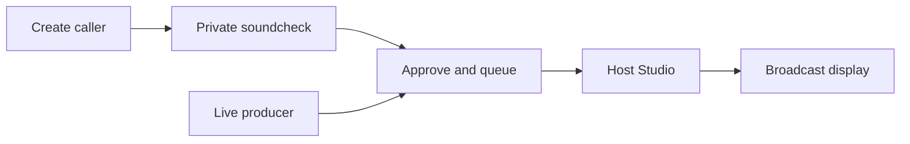

<div align="center">

<h1>AI Phone-In / Studio</h1>

<p><strong>Build and run live, human-hosted phone-in shows with fictional AI callers.</strong></p>

<p>
Create callers, arrange a live running order, hold private voice soundchecks and send a clean,<br />
privacy-filtered programme display to OBS, Twitch, TikTok Live Studio, Kick or another broadcast workflow.
</p>

<p>
  
  
  
  
  
  
  
  
</p>

</div>

> [!IMPORTANT]
> This is a hobbyist-first, local production toolkit. One trusted admin can build callers, run shows and open the same show from a second producer browser. It deliberately avoids enterprise account and team-management infrastructure so the live workflow stays approachable.

## The production flow



| Caller Workshop | Show workspace | Host Studio | Broadcast output |
| --- | --- | --- | --- |
| Start with one sentence, choose from six genuinely different routes, or quick-add a caller manually. Fine-tuning stays optional. | Own the running order, format, voice route, sound cues and output link. | Talk to callers, manage the queue, trigger media and monitor live audio. | Present only the public caller card, selected visual and caller audio EQ. |

The format is intentionally flexible. It can support advice, audience stories, sport, discussion, competitions, specialist topics, entertainment or a format of your own.

## What works today

- Multiple independent show workspaces.
- A deliberately shallow AI caller builder: one seed, optional call-type/tone preferences, six varied directions and one ready-to-use card.
- Quick manual caller creation with only the on-air essentials required; identity, voice, behavioural notes and graphics are collapsible extras.
- Searchable caller management with ready/draft/history status, topic filters, portraits and direct private soundchecks.
- A six-caller demo pack spanning advice, personal stories and eccentric theories: Aisha, Ellie, Owen, Ruth, Baz and Priya.
- Selectable generated avatars, OpenAI image generation, Pexels and Pixabay visuals.
- Private caller soundchecks that cannot alter the live queue or programme output.
- OpenAI Realtime 1.5 browser voice as the default, with host/caller meters and transcripts.
- Optional Gemini Live routing with server-minted one-use browser credentials, native audio and adjustable VAD.
- Optional ElevenLabs Conversational AI and Fish Audio turn-based comparison routes with per-caller voice IDs.
- Explicit voice-presentation casting for generated and manually edited callers, with compatible OpenAI and Gemini voice selection.
- Three temporary Host Studio direction controls for caller energy, pace and answer length.
- Drag-and-drop running orders, caller reactivation and additions during a live show.
- Automatic incoming, connected and host hang-up tones.
- Optional cheer, horn, rimshot and custom soundboard cues.
- Adaptive web, TikTok 9:16, Twitch/OBS 16:9 and transparent overlay output modes.
- A caller-output EQ shared with the broadcast display.
- Photographer/contributor attribution retained from stock search to the live output.
- Privacy-filtered broadcast data that excludes private caller mechanics and API keys.
- Two deliberately hidden automation modules: an AI Host with supervised and guarded auto-run modes, plus a staged 10–20-caller Factory. Both are off in a fresh installation and require a separate opt-in for each show.

## Quick start

### Requirements

- Node.js 20 or newer; Node 22 is recommended.
- npm.
- Chrome or Edge for microphone and WebRTC testing.
- An OpenAI API key for caller generation, AI images and OpenAI Realtime voice.

### First run on Windows

```powershell
git clone https://github.com/paolodit/phone-in-studio.git
cd phone-in-studio
npm install
Copy-Item .env.example .env.local
npm run db:generate
npm run db:local:init
npm run dev
```

Edit `.env.local` before starting and replace at least:

```dotenv
ADMIN_PASSWORD=choose-a-local-admin-password
AUTH_SECRET=choose-a-long-random-secret
OPENAI_API_KEY=your-server-side-openai-key
```

Open [http://localhost:3000](http://localhost:3000) and sign in with `ADMIN_PASSWORD`.

> [!CAUTION]
> `npm run db:local:init` applies migrations and resets the development fixtures. Use it for first-time setup or an intentional reset, not as the normal start command when you want to retain local shows and callers.

For later sessions, normally run only:

```powershell
npm run dev
```

This starts the detached local PostgreSQL runtime and Next.js together. Leave `DATABASE_URL` unset in `.env.local` for the local workflow; the development script supplies the connection.

To add or refresh the varied six-caller demo pack without resetting your own shows or callers:

```powershell
npm run db:demo
```

## Configuration

All provider credentials remain server-side. Never commit `.env.local`.

| Variable | Required | Purpose |
| --- | --- | --- |
| `ADMIN_PASSWORD` | Yes | Password for the local admin login. |
| `AUTH_SECRET` | Yes | Signs the HTTP-only admin session cookie. Use a long, unique value. |
| `OPENAI_API_KEY` | Recommended | Caller Workshop, OpenAI Realtime and AI image generation. |
| `OPENAI_REALTIME_MODEL` | No | Overrides the default `gpt-realtime-1.5` voice model. |
| `OPENAI_CALLER_GENERATION_MODEL` | No | Overrides the Caller Workshop model. |
| `OPENAI_HOST_MODEL` | No | Overrides the model used to write AI Host turns. |
| `OPENAI_HOST_TTS_MODEL` | No | Overrides the speech model used for the AI Host; defaults to `tts-1`. |
| `OPENAI_IMAGE_MODEL` | No | Overrides the image-generation model. |
| `GEMINI_API_KEY` | No | Enables the Gemini Live comparison route. |
| `GEMINI_LIVE_MODEL` | No | Overrides `gemini-3.1-flash-live-preview`. |
| `GEMINI_LIVE_VOICE` | No | Forces one Gemini prebuilt voice instead of mapping caller voices. |
| `ELEVENLABS_API_KEY` | No | Enables the ElevenLabs Conversational AI route. |
| `ELEVENLABS_AGENT_ID` | No | Selects the ElevenLabs Agent used for conversations. |
| `FISH_API_KEY` | No | Enables the turn-based Fish Audio TTS/ASR comparison route. |
| `FISH_AUDIO_MODEL` | No | Fish speech model; defaults to `s2.1-pro-free`. |
| `FISH_AUDIO_VOICE_ID` | No | Optional global Fish voice model ID; a caller-level ID takes priority. |
| `FISH_AUDIO_LATENCY` | No | `low`, `balanced` (default) or `normal`. |
| `FISH_DIALOGUE_MODEL` | No | OpenAI model used to write caller turns before Fish renders them. |
| `PEXELS_API_KEY` | No | Enables Pexels topic-image search. |
| `PIXABAY_API_KEY` | No | Enables Pixabay search or provider fallback. |
| `DATABASE_URL` | Production only | PostgreSQL connection for a deployed environment. |

Restart `npm run dev` after changing environment variables.

## Using the studio

### 1. Build a caller

Open **Callers** and choose one of two routes:

- **Develop with AI** - enter a situation, opinion, story or dilemma; compare six directions; build one into a detailed caller card; then save it as an editable draft.
- **Create manually** - enter the public caller identity and private performance card directly.

The AI workshop never publishes automatically. Generated callers stay private until a producer reviews and approves them.

Caller graphics can come from the stored avatar library, a custom image URL, OpenAI image generation or a stock provider. Prepared topic images are separate from the caller portrait and are always triggered manually by the producer or host.

### 2. Test the caller privately

Open a caller and choose **Test voice privately**.

The soundcheck supports OpenAI Realtime, Gemini Live, ElevenLabs or Fish Audio, displays microphone and caller-output meters, and keeps a temporary transcript. **Open test output** provides a separate presentation view for checking the portrait and caller EQ.

This test route does not update a show, running order, production event log or live broadcast display. Use headphones, hear the opening line, speak naturally and pause for the reply.

### 3. Create a show

Open **Shows**, choose **New show**, then configure:

- programme title and format;
- show-level caller guidance;
- OpenAI Realtime, Gemini Live, ElevenLabs or Fish Audio voice routing;
- approved callers and their running order;
- custom sound cues and shortcuts;
- the private broadcast-output link.

Each show owns its own Studio, running order, options and output.

### 4. Go live

1. Open the show in **Studio** and start the show.
2. Bring in the first caller; the programme display changes to **Coming up next**.
3. Answer when the host is ready and connect the selected AI voice route.
4. The caller opens naturally, then responds after each host turn.
5. Interrupt, mute, hold, resume, show prepared media or trigger optional sounds as needed.
6. End the call; the hang-up tone plays and the next caller is prepared automatically.
7. Reactivate completed callers or requeue the full running order when needed.

There is no redundant second step to fetch the next caller after ending a call. The next caller is prepared automatically, while the host controls the exact moment they go on air.

## Simple two-producer operation

Keep the **Host Studio** open for the presenter and the relevant **show workspace** open for a producer in another browser or computer.

The producer can create and approve new callers and add them to the running order while the host continues the current call. The Studio refreshes its queue without interrupting live caller audio.

Both browsers intentionally use the same trusted local admin. Avoid editing the same caller or running order at exactly the same moment; proper organisation accounts, invitations, presence and role management are outside this hobbyist-first scope.

## Optional automation modules

The normal first-run experience remains a human host building or choosing callers manually. Open **Settings → Optional modules** only when you want automation. A global switch makes a module available; each show then opts into it separately under **Show options**. Disabling a global switch removes the module from normal navigation without deleting its profiles, batches or callers.

### AI Host

1. Enable **AI Host** under Optional modules.
2. Create a presenter profile with a public identity, voice, style and a few behavioural sliders.
3. Use the private soundcheck to hear one response without touching a live show.
4. Assign the profile to a show and choose **AI host · supervised** or **AI host · auto-run**.
5. In supervised mode, press **AI host: one turn** when the presenter should speak.
6. In auto-run mode, choose a per-caller presenter-turn limit, delay between calls and visual policy, then deliberately press **Start auto-run** in Studio.

Auto-run starts and answers queued callers, responds after completed caller turns, closes at the configured turn limit, and advances the running order. It never arms on page load. **Take over**, **Pause auto-run** and **Emergency Stop** remain authoritative, and a generation, speech or transition error pauses automation for the human host.

Automated topic visuals have three policies: **Off** keeps the portrait on screen; **Prepare** gives the host three credited stock images to trigger manually; **Full auto** prepares those images and shows the primary one after the caller's opening contribution. Images are fetched while developing or accepting the candidate rather than during the live call. A missing provider key, empty search or display error falls back to the portrait and never stops the audio conversation.

### Caller Factory

The Factory develops **10–20 candidates per batch** from a broad editorial brief. It works in small resumable chunks, checks new headlines against the batch and existing caller library, and stores results in a separate candidate inbox. When its show enables prepared or automatic visuals, each new candidate also receives up to three topic images with creator and provider attribution. You can pause or cancel a batch, edit a candidate, reject it, restore it, or accept one or all candidates.

Acceptance is the boundary: only an accepted candidate becomes a normal editable caller draft. Nothing is automatically approved, queued or sent to a broadcast. An optional show assignment gives the batch editorial context but still does not alter that show's running order.

## Voice routes

### OpenAI Realtime

The default is `gpt-realtime-1.5`. The browser captures the host microphone and creates a WebRTC offer. The server negotiates the Realtime call with `OPENAI_API_KEY`; the permanent key is never sent to the browser. Turn-taking uses high-eagerness semantic VAD so the caller responds promptly at a meaningful end-of-turn. Automatic barge-in is disabled to prevent incidental room noise cancelling a caller mid-answer; the host uses **Interrupt** or the **Space** shortcut for a deliberate cut-in.

Each caller can have a supported voice, perceived voice-presentation preference, pace, speech style, response length and interruption behaviour. Feminine, masculine and neutral preferences are casting metadata rather than a claim about the character's identity. OpenAI and Gemini enforce a compatible voice; **Any** preserves a producer's exact choice. ElevenLabs and Fish callers can each store a provider-specific voice/model ID; otherwise that route's global or agent default remains in control.

While a caller is connected, the Host Studio exposes three centred sliders: **Energy**, **Pace** and **Answer length**. They nudge the next reply relative to the saved caller card and reset for every new caller. They do not permanently edit the character. Gemini queues a change until its current answer finishes so moving a control cannot interrupt the caller.

Microphone access requires `http://localhost:3000` on the same computer or an HTTPS deployment. A plain HTTP LAN address is not a secure browser context and cannot use `getUserMedia`.

### Gemini Live

Set `GEMINI_API_KEY`, restart the app, then select **Gemini Live** in Show options or the private soundcheck. The adapter currently targets `gemini-3.1-flash-live-preview` and uses Google's official `@google/genai` SDK.

The permanent key remains server-side. The server creates a one-use, one-minute connection credential whose session configuration is locked to the selected caller. Browser audio is sent as PCM; Gemini audio is played through the same caller-output meter and broadcast EQ used by the other providers.

The current comparison settings use:

- low speech-start sensitivity with a 400 ms speech commitment window to reject incidental room noise;
- low speech-end sensitivity with 650 ms silence tolerance so a natural host pause stays within one turn;
- no automatic microphone barge-in while the caller is answering; use the Studio's **Interrupt** control or **Space** shortcut for a deliberate cut-in;
- minimal thinking, audio input/output transcripts and a short caller response budget.

This is an optional preview route, not a promise that it will outperform OpenAI in every room. Test with the actual microphone, headphones and ambient noise you intend to use. Gemini Live sessions and preview model availability are provider constraints; see Google's [Live API guide](https://ai.google.dev/gemini-api/docs/live-api) and [ephemeral-token guidance](https://ai.google.dev/gemini-api/docs/live-api/ephemeral-tokens).

### ElevenLabs Conversational AI

Set `ELEVENLABS_API_KEY` and `ELEVENLABS_AGENT_ID`, restart the app, then select **ElevenLabs Agent** in Show options or the private soundcheck.

The server requests a short-lived conversation token for each connection. Caller instructions are passed as a session override, and an optional caller voice ID can replace the Agent default.

### Fish Audio S2.1

Set `FISH_API_KEY`, restart the app, then select **Fish Audio S2.1 (turn-based)** in Show options or the private soundcheck. The default is Fish's `s2.1-pro-free` developer-tier model; set `FISH_AUDIO_MODEL=s2.1-pro` to compare the paid model. A Fish voice page's model ID can be stored on an individual caller, or supplied globally with `FISH_AUDIO_VOICE_ID`.

Fish Audio currently supplies speech synthesis and beta speech recognition, not the conversational reasoning and duplex session used by OpenAI Realtime or Gemini Live. The adapter therefore uses a clear four-stage turn:

1. conservative browser speech detection waits for a sustained host contribution and a 950 ms finishing pause;
2. the captured host turn is transcribed by Fish ASR;
3. the existing character prompt and `FISH_DIALOGUE_MODEL` prepare one short caller reply;
4. Fish TTS renders the reply through the normal caller-output meter and broadcast EQ.

This route deliberately ignores microphone noise while the caller is playing. **Interrupt** stops playback, but Fish cannot provide true full-duplex barge-in in this integration. It is best used to compare voice naturalness, pace and casting rather than interaction latency. `FISH_AUDIO_LATENCY=balanced` is the default compromise; `low` starts faster at a possible quality cost, while `normal` favours quality.

The Fish key remains server-side. The app accepts Fish's official `FISH_API_KEY` variable and calls the documented [`POST /v1/tts`](https://docs.fish.audio/api-reference/endpoint/openapi-v1/text-to-speech) and [`POST /v1/asr`](https://docs.fish.audio/api-reference/endpoint/openapi-v1/speech-to-text) endpoints. Check Fish's live [pricing and concurrency limits](https://docs.fish.audio/developer-guide/models-pricing/pricing-and-rate-limits) before a long show: TTS is measured by input bytes, ASR by audio duration, and the starter tier currently permits five concurrent requests.

## Broadcast output

Open **Broadcast output** from a show workspace. Its URL contains an unguessable show token; treat the URL as private.

Recommended OBS setup:

1. Add the output URL as a Browser Source.
2. Treat the browser source as one content pane in your scene; the app does not assume or reserve a host-webcam object.
3. Use `layout=twitch` at 1920 x 1080 for a wide Twitch/OBS pane.
4. Use `layout=tiktok` at 1080 x 1920 for a portrait TikTok Live Studio pane.
5. Use `layout=web` when the pane may resize; it switches composition from its actual aspect ratio.
6. Use `mode=overlay` for a transparent treatment; layout defaults to `web`.
7. Capture the host microphone separately, then capture Studio browser audio for AI callers and sound cues.

Example URLs (retain the show's real token):

```text
/broadcast/SHOW_ID?token=TOKEN&mode=full&layout=web
/broadcast/SHOW_ID?token=TOKEN&mode=full&layout=tiktok
/broadcast/SHOW_ID?token=TOKEN&mode=full&layout=twitch
/broadcast/SHOW_ID?token=TOKEN&mode=overlay
```

The broadcast page does not emit the host microphone. Its EQ is driven by caller output reported by the Studio, so it should move only while the AI caller is producing audio.

## Privacy and safety boundaries

- `.env.local` is server-only and must not be committed.
- The admin session uses an HTTP-only signed cookie.
- Permanent OpenAI, Gemini, ElevenLabs and Fish Audio keys are never returned to the browser.
- The broadcast API exposes only public identity, public issue, caller graphic and the selected visual.
- Hidden story details, private prompts and producer notes remain inside authenticated tools.
- Generated and stock images still require editorial, licensing and broadcast-safety review.

For an internet-facing deployment, still add TLS, managed secrets, database backups and network access controls. The shared-admin workflow is intentional; this project is not trying to become a team SaaS account system.

## Commands

| Command | Purpose |
| --- | --- |
| `npm run dev` | Start the local database if required and run Next.js development mode. |
| `npm run db:generate` | Regenerate the Prisma client. |
| `npm run db:local:init` | Apply migrations and reset local fixtures. |
| `npm run db:local:stop` | Stop the detached local database runtime. |
| `npm run lint` | Run the TypeScript no-emit check. |
| `npm test` | Run the Vitest suite. |
| `npm run verify:local` | Verify an isolated show-state, persistence and privacy flow. |
| `npm run verify:realtime` | Verify an OpenAI temporary session credential without sending audio. |
| `npm run build` | Create a production build; stop the development server first. |

## Troubleshooting

<details>
<summary><strong>The app cannot reach 127.0.0.1:51214</strong></summary>

Stop any stale local database runtime and start again:

```powershell
npm run db:local:stop
npm run dev
```

For a new checkout, run `npm run db:local:init` once first.
</details>

<details>
<summary><strong>The microphone is unavailable</strong></summary>

- Use Chrome or Edge.
- Open exactly `http://localhost:3000`, not a plain HTTP LAN address.
- Allow microphone access in the browser's site controls, then use the in-app retry.
- Close applications that may have exclusive control of the device.
</details>

<details>
<summary><strong>The caller connects but cannot be heard</strong></summary>

- Check the caller volume and operating-system output device.
- Confirm the **Caller output** meter is moving.
- Use headphones to prevent feedback.
- End and reconnect; each attempt creates a fresh short-lived credential.
- Use the mock speaker line to separate output-device problems from provider problems.
</details>

<details>
<summary><strong>Gemini Live cannot start a caller</strong></summary>

Confirm `GEMINI_API_KEY` is present in `.env.local`, restart the app, and use a Gemini project with Live API access. Every attempt creates a fresh credential, so reconnect rather than reusing a failed session. If a preview model has changed, override `GEMINI_LIVE_MODEL` with a model supported by your project.
</details>

<details>
<summary><strong>ElevenLabs cannot start a caller</strong></summary>

Confirm that the API key and Agent ID belong to the same account and that the Agent supports WebRTC conversations. Restart the app after changing `.env.local`.
</details>

<details>
<summary><strong>Fish Audio cannot start or hear the host</strong></summary>

Confirm `FISH_API_KEY` and `OPENAI_API_KEY` are present in `.env.local`, then restart the server. Test the caller in the private soundcheck first. A 401 usually means the Fish key is invalid; 402 indicates account credit or plan access; 422 commonly points to an invalid caller voice model ID or unsupported request. If transcription repeatedly hears nothing, use Chrome or Edge on `http://localhost:3000`, allow microphone access and finish a full sentence before pausing.

</details>

## Project map

```text
app/                  Next.js pages, APIs and broadcast routes
components/           Studio, caller workshop, soundcheck and broadcast UI
lib/                  Show state, prompts, voice providers, auth and integrations
prisma/               Schema, migrations and development fixtures
scripts/              Local database and verification tools
tests/                State, queue, prompt, generation and voice tests
public/               Bundled caller and interface assets
```

## Sensible next steps

- Real-room comparison and tuning across OpenAI 1.5, Gemini Live, ElevenLabs and the turn-based Fish Audio route.
- Real-show testing and recovery tuning for guarded AI Host auto-run.
- Scheduling, cost caps and semantic duplicate detection for recurring Caller Factory batches.
- A 1:1 output preset plus user-adjustable safe areas and theme controls.
- Managed deployment, secrets, PostgreSQL backups and operational monitoring.
- More robust audio reconnection, device switching and provider failover.
- A reusable media library, attribution backfill for old assets and licence-review notes.
- Optional SIP or PSTN integration for real telephone lines.
- End-to-end browser automation for Studio and broadcast interactions.

Before every public stream, run the automated checks and then complete a real browser, headset and broadcast-route soundcheck:

```powershell
npm run lint
npm test
npm run verify:local
npm run verify:realtime
```

---

<div align="center">
Made with ❤️ by <a href="https://www.twoguysonecat.com">Two Guys One Cat</a>.
</div>
