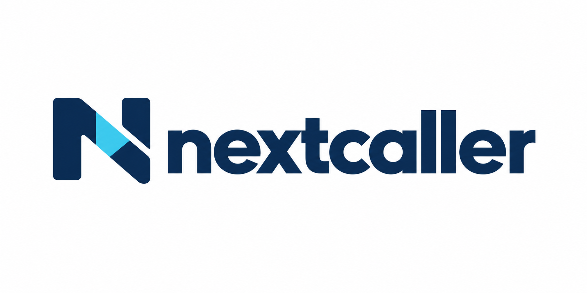
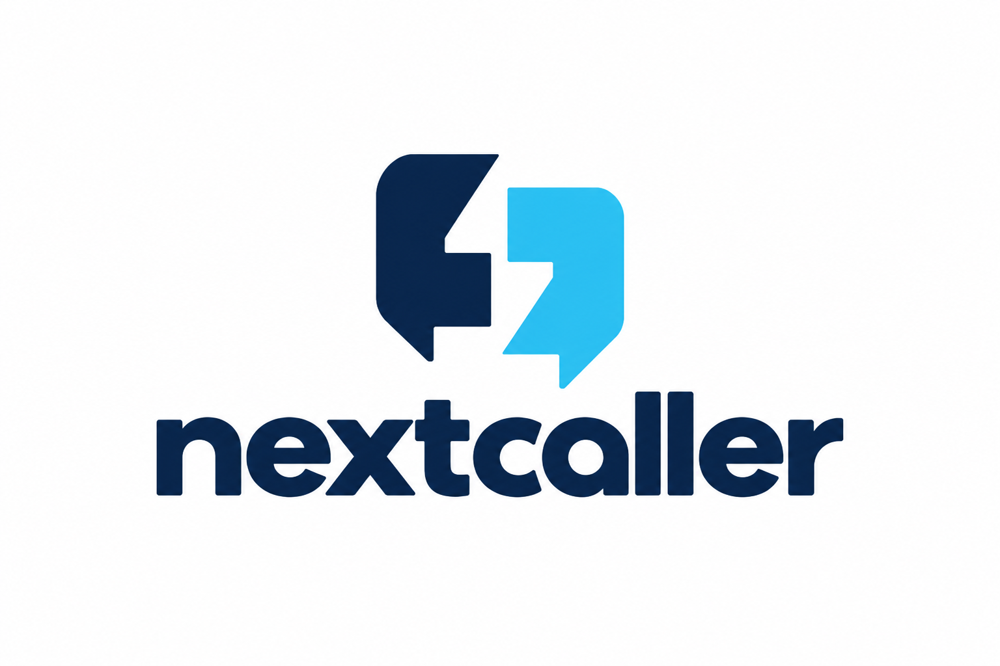
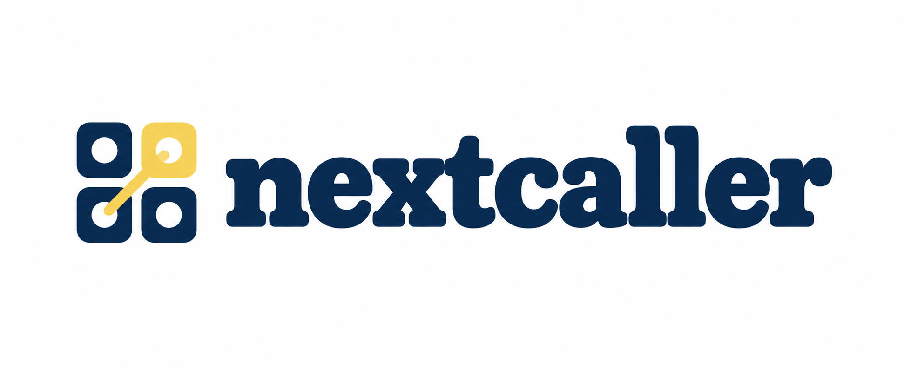
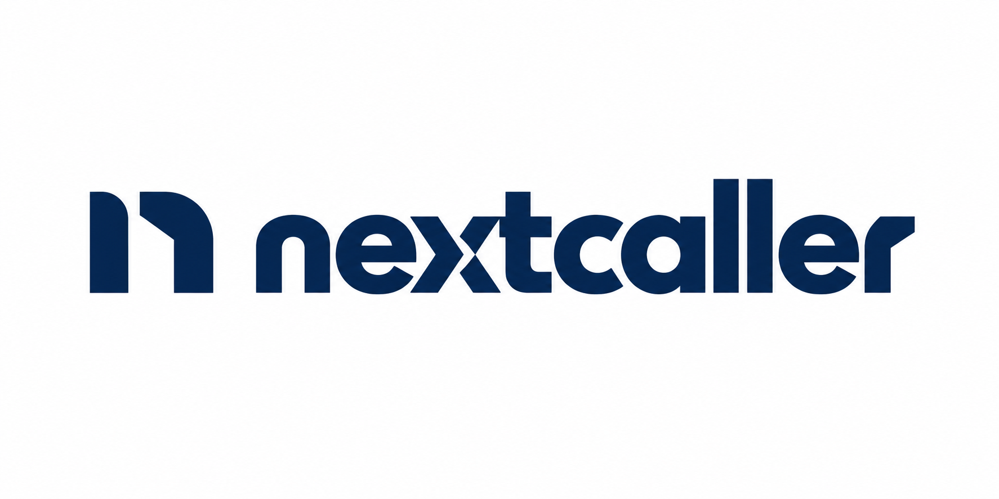

# NextCaller logo directions

**Latest round: [Callers forming the letters — E–G](caller-letterforms/README.md).**

Four identity concepts for the hosted NextCaller service, generated on 3 October
2026 using built-in Codex ImageGen. The public application remains AI Phone-In
Studio; these are shared symbol candidates and NextCaller wordmark studies,
not a rename or a second version of the app.

The brief was to replace the illustrated telephone with a simpler, more
recognizable identity. These PNGs are concepts for selection, not final vector
masters. No concept has replaced the current website or application logo.
The exact prompts are in [prompts.json](prompts.json).

| Direction | Character | Assessment |
| --- | --- | --- |
| A — Signal | Geometric N, navy and cyan | Bold and readable; closer to a software brand. |
| B — Two Voices | Opposing quotation forms | Communicates conversation in a stacked arrangement. |
| C — Switchboard | Radio-inspired symbol and slab lettering | My pick for personality and a connection to broadcasting. |
| D — Next Up | Monochrome lettering and compact symbol | The strongest option for a restrained identity. |

## A — Signal

## B — Two Voices

## C — Switchboard

## D — Next Up

After selection, refine the geometry and letter spacing, then produce a proper
SVG master, transparent variants, an icon-only version and small-size favicon
proofs. The same selected symbol can accompany the hosted NextCaller name and
the public AI Phone-In Studio name.
