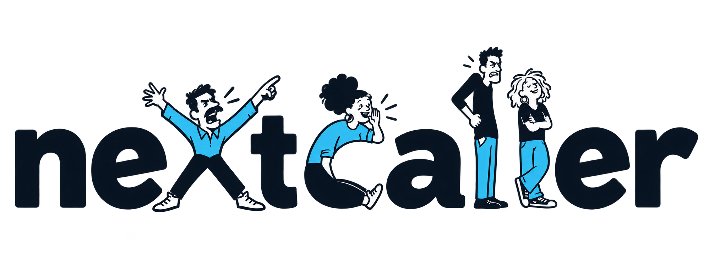

# Selected NextCaller identity

Selected on 4 October 2026: concept F, Cast of Characters, with the passive
bespectacled first l replaced by an indignant caller. The ranter x, chatty c
and relaxed second l retain the chosen design.

- [Transparent wordmark](../../../public/branding/nextcaller-wordmark.png)
- [Companion caller icon](../../../public/branding/nextcaller-icon.png)
- [Exact edit prompts](selected-prompts.json), using built-in Codex ImageGen

The wordmark is 1997 × 788 px and the icon is 1254 × 1254 px. Both PNGs have
genuine alpha transparency with opaque white faces. These are raster assets;
an editable vector master has not been produced.

The hosted NextCaller website consumes copies of these files. This does not
rename the public AI Phone-In Studio application. Keep the source artwork here
and copy selected revisions to the private website, rather than maintaining
separate designs.

The wordmark has transparent margins. The website frames it at a 3.75:1 aspect
ratio with object-fit: cover and object-position: 50% 40%; the visible artwork
remains entirely inside that frame. Use the square portrait for small icons.

[Earlier alternatives](caller-letterforms/README.md)
