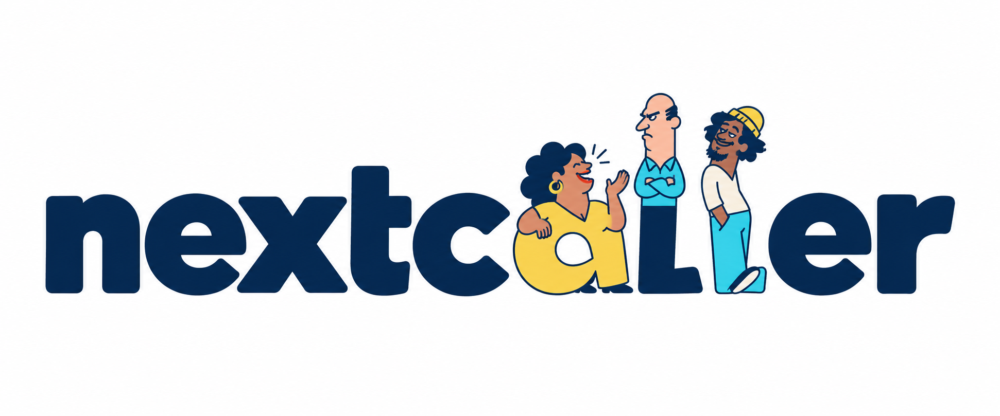
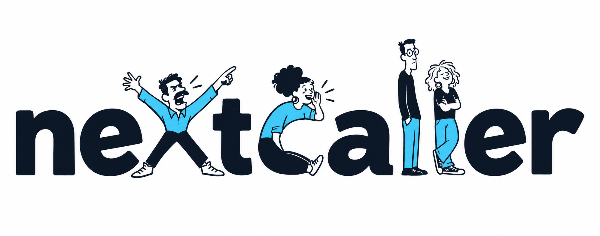
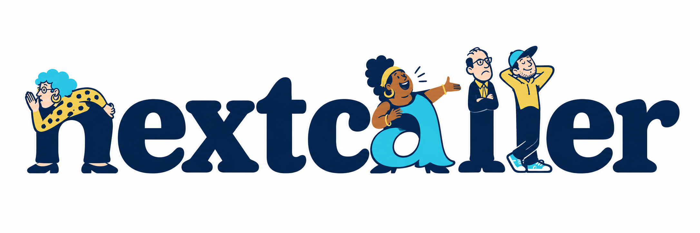

# NextCaller: callers forming the letters

Three wordmark alternatives generated on 4 October 2026 using built-in Codex
ImageGen, following the direction that different caller personalities should
help form some of the letters. Their poses and bodies become the letter shapes.

These are the original PNG concept studies. [F was selected and revised](../SELECTED.md), replacing the first l with an indignant caller.
The exact prompts are saved in [prompts.json](prompts.json).

| Concept | How the callers form the word | Assessment |
| --- | --- | --- |
| E — The Line-up | A chatty caller and two contrasting personalities form the central a-l-l. | Clearest overall wordmark; the cast stays together. |
| F — Cast of Characters | A ranter forms x, a curved chatty figure forms c, and a mismatched duo forms l-l. | Closest to the brief: body language does the lettering. Recommended direction to refine. |
| G — Radio Regulars | A nosy caller forms n, a storyteller forms a, and two regulars form l-l. | Warmest retro radio-comedy treatment; more illustrated detail. |

## E — The Line-up

## F — Cast of Characters

## G — Radio Regulars

For the next pass, preserve the readable name and distinct personalities,
simplify faces and clothing for header use, and check a small monochrome proof.
After selecting a direction, produce an editable vector master and a companion
small icon; the full illustrated wordmark will not fit a favicon.

[Earlier concepts A–D](../README.md)
