# Studio experience review · 9 September 2026

The app has a strong foundation: simple caller creation, show-specific running orders, and separation between private production notes and broadcast content. The main usability problem was competing priorities: setup, diagnostics and completed work occupied space needed for the current call and the next guest.

This pass preserves the existing visual identity and hobbyist-first scope. It concentrates on a calmer preparation workflow, a compact live desk, safer audio handling and a pane-aware output renderer.

## Reviewed journey

1. **Build a caller — clearer; recovery remains a gap.** The seed-first form stays small. A three-step indicator explains Describe → Choose → Review & save. Changing the source invalidates the previous generated pack; inputs cannot drift while a request is in flight. Recoverable drafts across navigation remain a useful next improvement.
2. **Prepare a show — substantially clearer.** Running order and searchable, one-click caller addition lead the page. Finished callers are folded away; optional checks, sound cues and configuration are secondary.
3. **Run the live desk — stronger hierarchy and control safety.** Core actions stay in a sticky transport. The current caller is compact and upcoming callers are easier to scan. Hold blocks microphone input as well as output. A real acoustic test is still needed.
4. **Compose the broadcast pane — testable without going live.** A private workbench uses the production renderer to exercise wide, portrait, square and short panes, all eight states, portrait fallback, image visibility, transparency and an explicitly simulated EQ.

## 1. Caller building and selection

The library already supported direct addition to a selected show. Its large summary cards were heavier than the task required; these are now compact counts. The show-target control more clearly explains the next action, and queue confirmation resets correctly when the selected show changes.

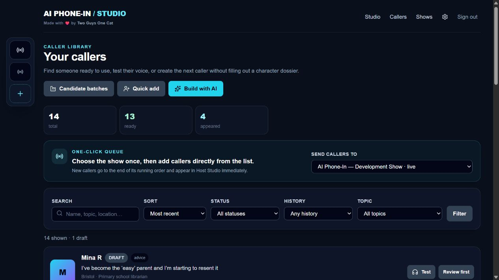

The builder retains one main writing field and two optional preferences. Generated notes are labelled as read-only rather than implying in-place editing. Dictation startup errors and cleanup are handled. Editing the source or preferences clears stale generated options.

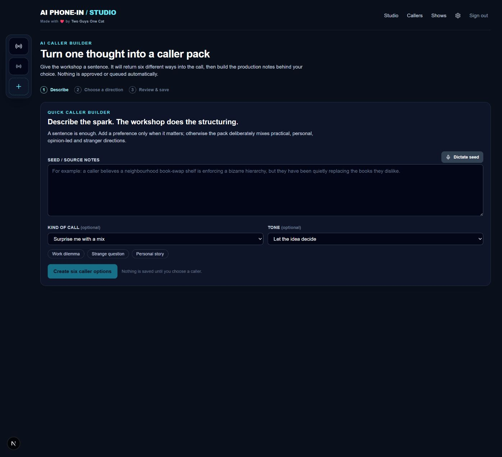

**Accessibility:** explicit seed label, disabled busy controls, visible step state and focus-visible styling. Screen-reader completion of generation/save, microphone permission prompts and mobile dictation were not tested end to end.

## 2. Show preparation

Before, configuration and preflight competed with the running order. The line-up and ready callers now appear first. Search keeps caller addition manageable; successful additions retain a checked state. The list refreshes during a live show without reconnecting its audio.

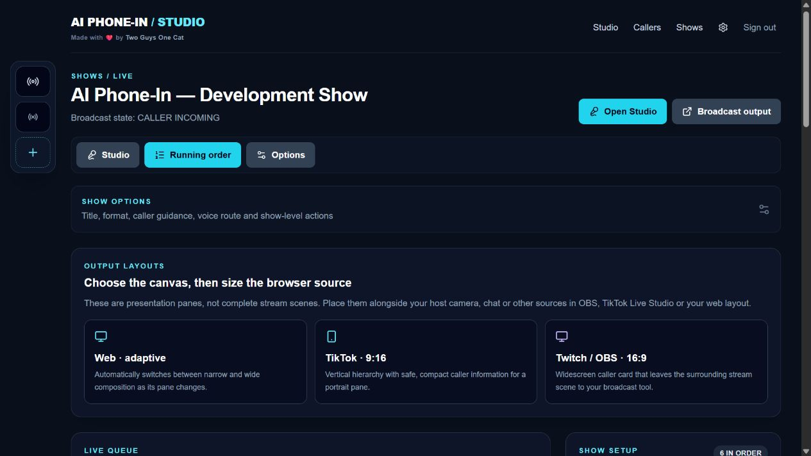

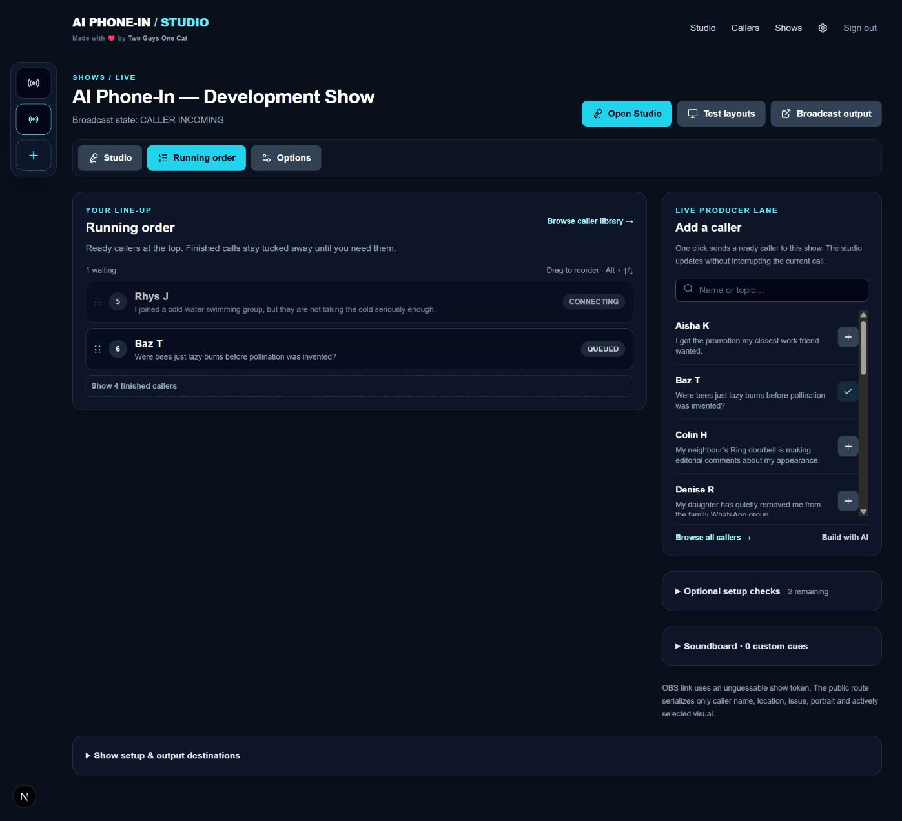

Finished callers can be expanded and reactivated. A focused queued row supports Alt + Up/Down as well as drag. Optional checks no longer make missing supporting images look like a blocker.

**Remaining:** remove/undo for queued guests, show-context breadcrumbs in the builder, touch-friendly reorder affordances and conflict feedback when producer windows edit the same order. Keyboard reorder still needs a fuller browser accessibility pass.

## 3. Live operation

The sticky transport gives Answer, Take the floor, Mute, Hold, End and Stop all one predictable home. The caller portrait and compact briefing replace an oversized identity block. Audio setup and event history are secondary; meters and volume remain visible while connected.

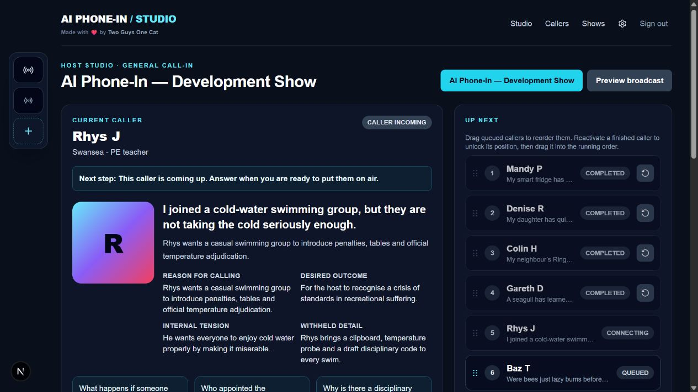

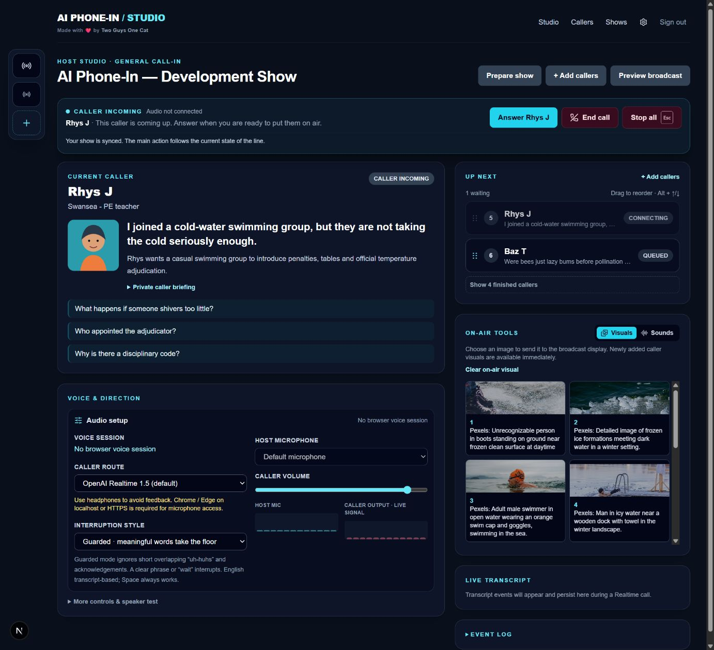

Reliability improvements:

- Hold mutes host microphone and caller output; resume restores both.
- Stop/takeover abort pending AI-host requests and prevent cancelled speech starting later.
- Taking the floor also pauses AI auto-run.
- Stop all stops custom sounds, synthetic cues and browser mock speech.
- Pending caller connections can be cancelled; a late microphone grant is released rather than starting an unwanted OpenAI session.
- Private soundcheck has a cancel-connection action and releases a late connection when its page is left.
- Failed OpenAI connections release media resources and expose a reconnect state.
- OpenAI microphone replacement preserves mute state and releases a rejected replacement track.
- Meter rendering is throttled separately from audio processing; remote level posts cannot accumulate unlimited concurrent requests.
- Background transcript-save failures produce a message instead of an unhandled rejection.

**Accessibility:** text-labelled actions, consistent icon spacing and focus-visible styling. Shortcuts avoid text entry, focused controls and repeated key events; Escape remains an emergency stop. The complete assistive-technology interaction matrix remains untested. The real Studio was inspected in its incoming-call state; live/hold audio was not manipulated during the audit.

## 4. Broadcast composition

Presentation is separated from live transport, so layout testing cannot mutate the show. Pane-relative sizing and short-pane rules constrain long text. Images stay edge-to-edge with small creator attribution. Idle, break and ended-show states no longer retain the previous caller. Transparent mode also clears the document background.

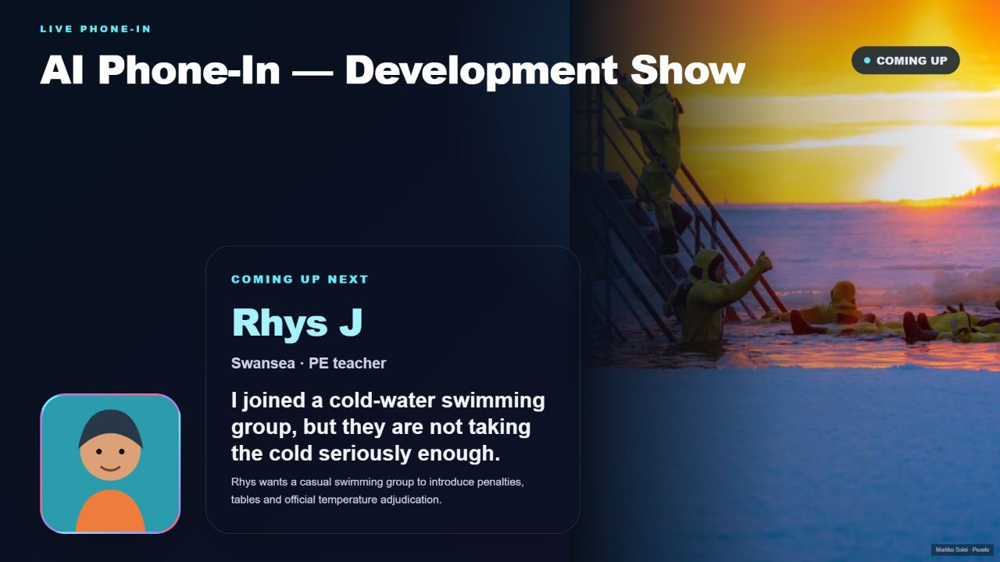

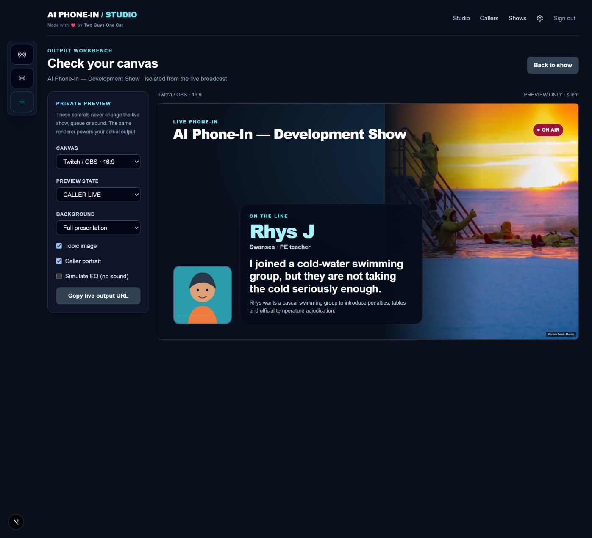

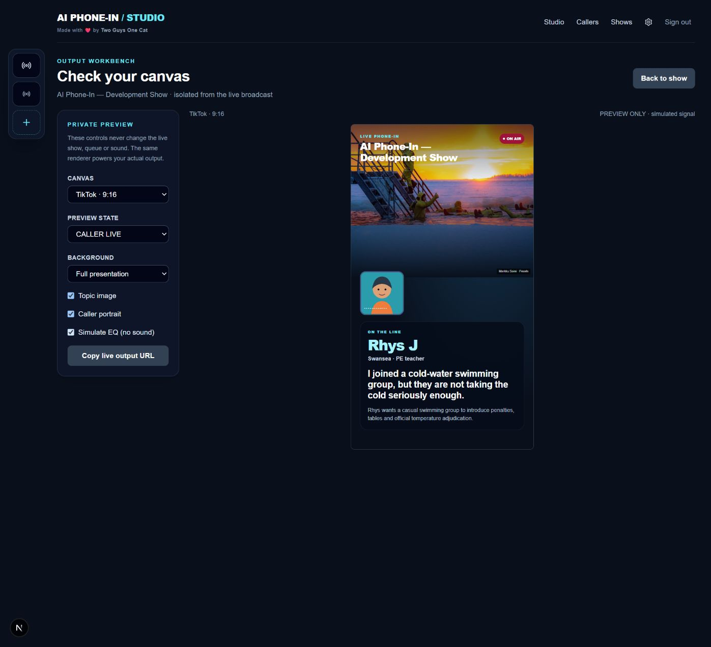

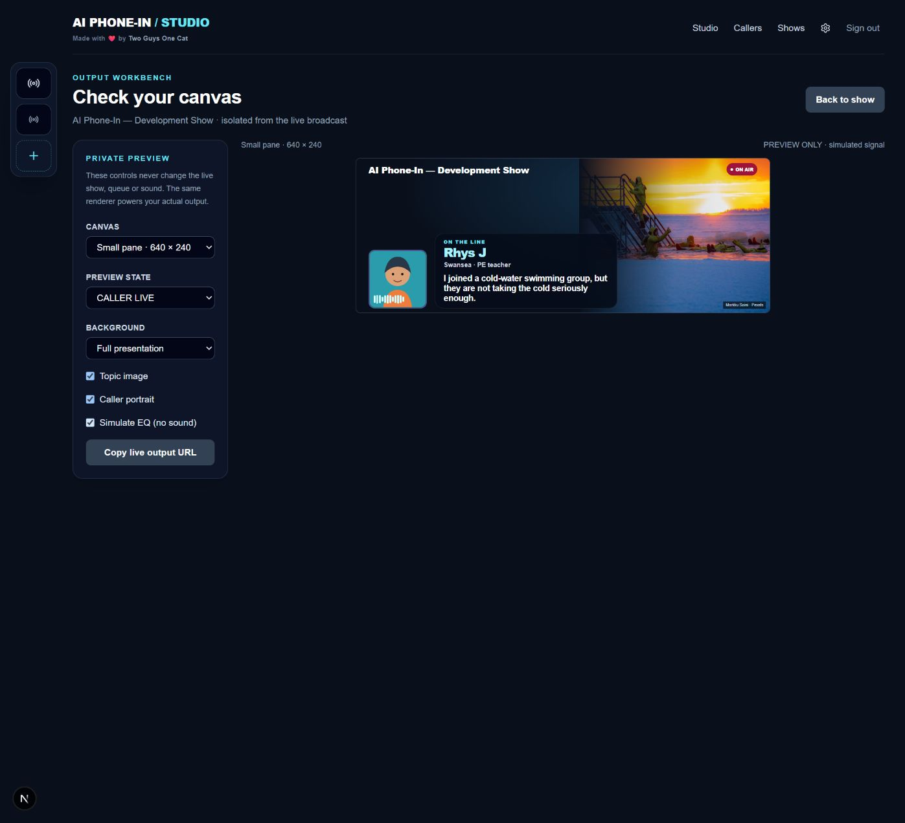

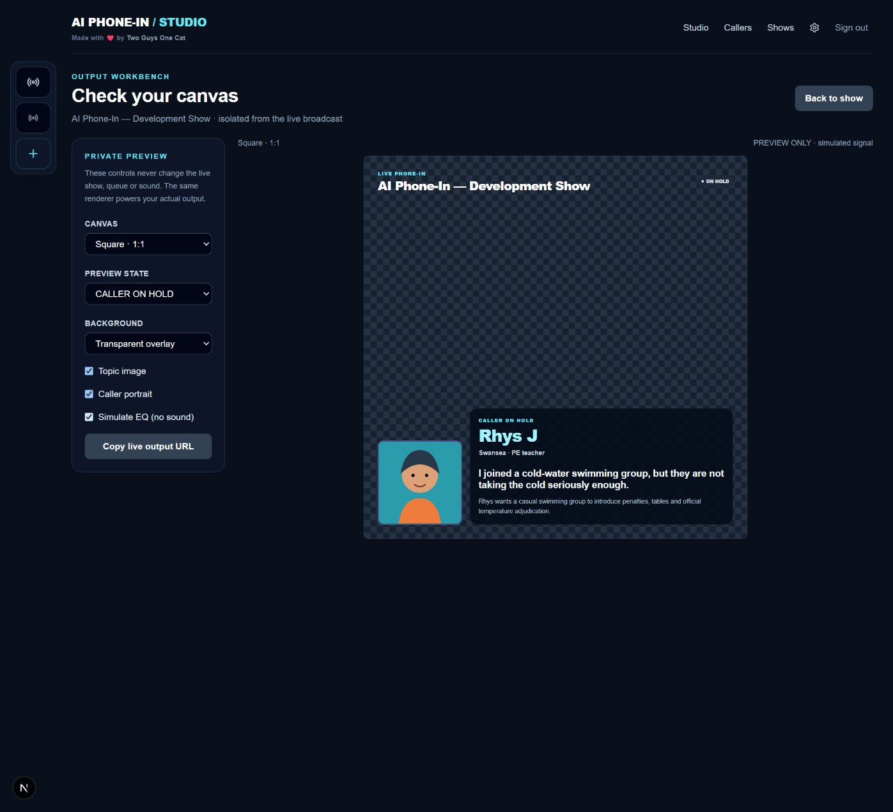

The EQ takes direct same-browser updates with SSE fallback for separate clients. Recent direct frames win over older server frames; invalid frames are sanitised and stale signal clears. SSE cleanup is idempotent and slow clients do not accumulate disposable meter frames.

**Limits:** reduced-motion preferences are respected, but broadcast captions are not implemented. Short panes deliberately omit the optional summary and clamp long headlines. Check credit legibility at the actual encoded stream resolution. OBS/TikTok ingestion and platform-specific chat/safe-area overlays were not tested.

## Voice changes and their limits

### OpenAI: guarded turn-taking, with 1.5 retained

The model remains `gpt-realtime-1.5`, using high-eagerness semantic VAD. Server automatic response creation and interruption are disabled; the browser serialises response creation after the host audio item is committed.

- Normal non-overlapping turns can receive a reply without waiting for transcription.
- Overlapping acknowledgements such as “uh-huh”, “mm”, “right” and “go on” do not automatically cancel the caller.
- Meaningful overlapping phrases can take the floor. “Wait” and “hold on” can act on partial transcription.
- Manual mode and the explicit interrupt button remain available.
- Cancellation and the next response are serialised; audible output is cleared for an accepted interruption.
- Playback state uses WebRTC output-buffer events, not audio-delta events from a different transport path.
- Output-token allowance increased from 180 to 1024, reducing a plausible source of mid-sentence truncation. This is not a diagnosis of every previous cutoff.

This is an **English transcript heuristic, not perfect full duplex**. ASR latency, provider behaviour, missed words and room conditions still matter. The displayed reply timing measures semantic speech-stop to caller stream-start, excluding end-of-turn detection and browser playout; it is not an end-to-end benchmark.

Sources: [OpenAI VAD guide](https://developers.openai.com/api/docs/guides/realtime-vad), [Realtime server-event reference](https://platform.openai.com/docs/api-reference/realtime-server-events).

### Gemini: reduce avoidable waiting, retain noise protection

The microphone gate during caller playback and `NO_INTERRUPTION` remain: this route is not newly duplex. Capture buffers decrease from 4096 to 1024 samples, the local post-playback gate becomes 100 ms, and configured speech-end silence decreases from 800 to 600 ms. These are configuration changes, not measured conversational improvements.

In-session text uses `sendRealtimeInput`, following Gemini 3.1 guidance. Manual interrupt stops local playback and discards arriving chunks from the old turn until completion, preventing late chunks restarting it. With server automatic interruption disabled, local silence does not guarantee instantaneous remote cancellation.

Sources: [Google Live capabilities](https://ai.google.dev/gemini-api/docs/live-api/capabilities), [Live API reference](https://ai.google.dev/api/live).

### Other providers

ElevenLabs retains provider-native turn-taking. Fish remains transcription → response → speech, not duplex. Playback callbacks allow AI-host scheduling to wait for caller playback rather than a transcript alone.

## Verification

- `npm run lint` — passed.
- `npm test` — **70 tests passed across 17 files**.
- `npm run verify:local` — isolated state/persistence/privacy flow passed; its temporary show was removed.
- `npm run verify:realtime` — OpenAI accepted the session configuration; no microphone audio was sent.
- Browser inspection — Studio, show workspace, callers, builder and private layout workbench loaded locally.
- All eight preview states checked in a short pane: no pane overflow observed; caller, image and EQ visibility matched the state mapping.
- Wide, portrait, square/transparent and short layouts inspected and captured during this review.

New tests cover interruption decisions and sequencing, OpenAI connection readiness/cleanup, muted microphone replacement, broadcast state mapping and malformed meter data.

**Not verified:** actual acoustic interruptions, measured end-to-end latency, long-running sessions, paid caller generation, production build or OBS/TikTok capture. The development server was kept running rather than sharing its build directory with a production build. Screenshots alone do not establish accessibility compliance.

## Recommended next work

1. **Controlled headset soundcheck:** compare guarded/manual OpenAI, then Gemini, using silence, breathing, “uh-huh”, hesitation, a real overlapping question and deliberate stop. Record perceived timing and cutoffs before further tuning.
2. **Recoverable preparation:** preserve unfinished drafts, carry selected show through creation and add queue removal with undo.
3. **Audio resilience:** test device loss/reconnect under sustained use; migrate Gemini's deprecated ScriptProcessor capture to AudioWorklet. Keep provider fallback under explicit operator control.
4. **Output finishing:** configurable safe areas, branded themes, long-title fixtures and validation at actual stream sizes.
5. **Browser regression tests:** connection cancellation, hold/resume, AI-host takeover, queue edits and output transitions without provider spend, plus a small opt-in acoustic suite.

Existing show and caller content was left intact.
